# Prompt 收藏夹 — 项目全景

一个 **本地优先的 Prompt 片段管理器**：WPF 桌面应用，数据是磁盘上的 Markdown 文件，界面用 `StartUI4Controls` 组件库（源码随包 vendor）。

本文按八个大章节记录项目全景，末尾附录保留**运行与构建**。

**口径声明**：全文以 `app/` 与 `lib/` 的当前源码为唯一事实来源，每条结论都带 `文件:行号`。文中不引用旧文档的说法；数字（体积、断言组数）除明确标注"实测"外，一律注明记录出处。

---

## 目录

| 章节 | 内容 |
|---|---|
| [一、创建目的与解决的问题](#一创建目的与解决的问题) | 它是什么、替谁解决什么、刻意不做什么 |
| [二、项目技术栈](#二项目技术栈) | 运行时、UI、依赖、打包、每层的选型理由 |
| [三、项目架构](#三项目架构) | 分层、工程拓扑、存储拓扑、依赖方向与例外 |
| [四、代码地图](#四代码地图) | 逐文件清单、找东西去哪儿、零引用点 |
| [五、组件架构](#五组件架构) | UI 组件树、绑定契约、ViewModel 协作、控件库使用面 |
| [六、数据流图](#六数据流图) | 启动、读、写、复制、设置、主题、搜索、拖动、自愈 |
| [七、工作流程](#七工作流程) | 用户动线、编辑态状态机、根切换、开发验证流程 |
| [八、工作原理](#八工作原理) | 13 条机制与其背后的坑 |
| [附录 A、运行与构建](#附录-a运行与构建) | 构建、两档打包、自测、配置落点、图标、界面速查 |
| [附录 B、术语表](#附录-b术语表) | 模块/条目/frontmatter/kv1/令牌/判据等 20 个词 |

---

## 一、创建目的与解决的问题

### 1.1 一句话定位

把日常要重复粘贴给 AI 的 Prompt 存在**自己的文件夹**里，用的时候**两次点击进剪贴板**；要改就在右栏改，改完就是文件本身。

三个高频动作定义了它的全部核心面（`Prompt 收藏夹 — 最终软件设计方案.md` §1）：

1. **复制** — 最短路径把纯正文送进剪贴板。
2. **编辑** — 右栏直接改正文与元数据，`保存` 或 `Ctrl+S` 落盘。
3. **收藏与排序** — 按当前模块筛收藏项，按使用次数/时间/名称/自定义顺序排。

### 1.2 它替代的是什么做法，解决的具体问题

| 常见替代做法 | 它的问题 | 本项目的处置（代码出处） |
|---|---|---|
| Prompt 散落在备忘录、聊天记录、各个云文档里 | 找不到了；同一支 Prompt 长出五个版本 | 一模块一文件夹、一条目一 `.md`（`Services/FileSystemRepository.cs:21-43`） |
| 存在 Notion / 云笔记 | 要网络、要登录、导出格式被锁定 | 纯本地文件，无网络调用；`app/` 里没有任何 HTTP 客户端 |
| 用数据库或自建 JSON 大文件存 | 换机器要迁移、程序一死数据就读不出来、备份要专用工具 | 无数据库；备份 = 复制 `Prompts` 文件夹 |
| 自己写一个 Markdown 文件管理器 | 元数据要么混进正文污染复制结果，要么另存一份跟正文不同步 | frontmatter 由程序维护、永不出现在复制内容与编辑区（`Services/FrontmatterParser.cs:110-130`） |
| 复制用系统默认（WPF `Clipboard`） | 可编辑控件里 `Ctrl+X` 实测卡约 2 秒（OLE 抢锁在调用线程重试） | 库内原生 Win32 通道 + 按键隧道接管（`lib/UI4Clipboard.cs`、`lib/Internal/ClipboardCommandTakeover.cs`，见 §8.8） |
| 用户手工同步外部编辑的 .md | 程序不认识字段被"顺手清洗"掉，Obsidian 加的字段一次保存就没了 | 未知键读时收下、写时原样带回（`Models/FrontmatterData.cs:21-41`、`Services/PromptService.cs:137-141`） |
| 设置写 JSON | 本项目真出过事故：写侧转义、读侧不反转义，反斜杠每存一次翻倍，设置文件撑到 16 MB，应用变成无窗口僵尸进程 | kv1 纯文本、写不转义读不反转义（`Services/SettingsCodec.cs:11-18`，见 §8.4） |

### 1.3 刻意不解决的问题（非目标）

这些不是遗漏，是明确划出去的边界，每条都有代码证据：

- **不做多端同步、不做云端**：数据的权威形态是本地目录树。
- **不做数据库、不做全文索引**：搜索是每次按键（防抖 300 ms 后）全盘读文件（`MainWindow.xaml.cs:31-33`、`Services/PromptService.cs:234-278`）。
- **不做"跟随系统明暗"**：`Models/AppThemeMode.cs` 只有 `Light`/`Dark` 两个成员，刻意没有 `System`——加了就等于允许设置文件里存进一个没人消费的取值，还要挂 `SystemEvents` 订阅（`AppThemeMode.cs:3-7`）。
- **不做"跟随系统字体"**：字体族由用户在设置面板里选，出厂值是一个复合字体栈。
- **不做删除按钮出现在右栏**：右栏只有`复制`与`保存`；删除走中栏右键（设计方案 §7.3）。
- **不做 Undo/Redo、不做版本历史**：要历史请把这个目录放进 Git 或同步盘。
- **不做后台文件监听**：外部改动靠重新加载中栏或重启自愈（设计方案 §15.3）。

### 1.4 三条贯穿全项目的公理

理解这三条，就理解了后面所有看起来"绕"的实现。

| 公理 | 含义 | 体现 |
|---|---|---|
| **文件即数据** | 没有第二种存储形态；程序状态全是文件的视图 | `PromptService`/`FileSystemRepository` 是唯一的磁盘入口（`Services/IPromptService.cs`、`Services/IFileSystemRepository.cs`） |
| **名字是权威** | 文件夹名 = 模块名，文件名 = 标题；frontmatter 里的 `title`/`module` 是派生副本 | 读时缺字段按名字补（`FileSystemRepository.cs:50-64`）；改名先改文件名/目录名（`PromptService.cs:149-164`） |
| **单源** | 任何一件事只有一个地方决定，其余处引用它 | 配色源色在 `Helpers/Theme.cs`；排印默认值与区间在 `Helpers/Typography.cs`；设置键归属在 `SettingsService.cs:154-162`；设置面板开合在 `MainViewModel.IsSettingsOpen`（`MainWindow.xaml.cs:41-47`） |

第三条"单源"是全项目返工最多的地方——几乎每一批观感修正，本质都是把第二处真源合并回第一处（§8.5、§8.7）。

### 1.5 第二重目的：组件库宿主接线范式

本项目同时是 `StartUI4Controls`（StartUI4.WPF v3.0.0，`lib/StartUI4Controls.csproj:19-25`）的**宿主范例**，示范四件在组件库里没有标准答案的事：

1. 宿主配色如何压过库内置主题而不被换档冲掉（§8.7）。
2. 宿主如何发布排印覆盖值，让库内控件模板跟着走（§8.5）。
3. 全局缩放为什么必须走 `LayoutTransform`，以及它的窗口下限连带代价（§8.6）。
4. 库能力与宿主实现并存时，哪些地方退了订、要不要回灌（§8.11）。

因此本项目的 `lib/` 是**源码自包含**（`app/PromptFavorites.csproj:53` 用 `ProjectReference` 而不是 NuGet 包），且带 6 处宿主必需的排印改动（§5.4）。

### 1.6 目标 → 手段 → 代价

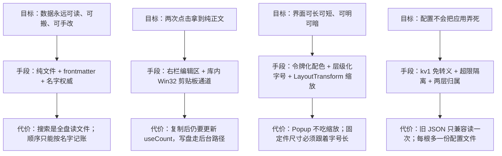

---

## 二、项目技术栈

### 2.1 栈清单

| 层 | 用什么 | 版本/口径 | 出处 |
|---|---|---|---|
| 运行时 | .NET 10（`net10.0-windows`） | 已从 `net48` 迁移完成 | `app/PromptFavorites.csproj:4` |
| UI 框架 | WPF | `UseWPF=true`；**不再引用 WinForms** | `csproj:5-6` |
| 语言版本 | C# `latest` | `Nullable=disable`、`ImplicitUsings=disable`（全项目仍是显式 `using`、可空引用未启用） | `csproj:7-9` |
| 组件库 | StartUI4.WPF | v3.0.0，`lib/` 源码 vendor，`ProjectReference` 引入 | `lib/StartUI4Controls.csproj:19-25`、`app csproj:53` |
| 编辑器内核 | AvalonEdit | 6.3.1.120，**整个工程唯一的第三方 NuGet 包**，被 `UI4CodeEditor` 使用 | `lib/StartUI4Controls.csproj:37` |
| 剪贴板 | 原生 Win32（库内 `UI4Clipboard`） | 读写在后台线程重试后回投 UI 线程 | `lib/UI4Clipboard.cs`、§8.8 |
| 目录选择 | `Microsoft.Win32.OpenFolderDialog` | .NET 8+ 的 WPF 原生 Vista 风格 IFileDialog，替代 WinForms 的 `FolderBrowserDialog` | `App.xaml.cs:143`、`MainWindow.xaml.cs:212` |
| DPI | 应用清单 `PerMonitorV2` | 本机 125% DPI 可抓屏自证 | `app/app.manifest:18-19` |
| 图标 | `app/AppIcon.ico`（7 挡 16–256） | exe 图标与窗口图标两条链路都指它 | `csproj:20`、`csproj:25` |
| 数据格式 | Markdown + YAML 风格 frontmatter | 自研解析器，不依赖 YAML 库 | `Services/FrontmatterParser.cs` |
| 配置格式 | kv1 纯文本（`key=value`） | 文件名仍叫 `settings.json`（历史遗留） | `Services/SettingsCodec.cs:21` |
| 依赖注入 | 无容器 | `App` 的三个静态属性是 composition root | `App.xaml.cs:15-17` |
| 测试框架 | 无 | 自研 `--selftest` 四段判据内建在产物里 | `Services/SelfTest.cs:16-43` |
| 打包 | `dotnet publish` 单文件 | 两档产物：自包含 / 框架依赖 | 附录 A.2 |

### 2.2 每层选型为什么是这个

- **WPF 而不是 WinUI/Avalonia**：组件库是 WPF（net10.0-windows 纯 C# 模板控件），本项目同时承担它的宿主示例（§1.5）。
- **`Nullable=disable` + 显式 `using`**：与 `net48` 基线保持逐行可比——迁移时若回归 FAIL，能归因于运行时差异而不是语法差异（`lib/StartUI4Controls.csproj:6-9` 同一决策）。
- **不用 DI 容器**：应用只有一个窗口、一棵 ViewModel 树、一个服务实例。`App.Service`/`App.Settings` 静态属性换根时整体重建（`App.xaml.cs:104-135`），比容器更直白。
- **不用 YAML 库解析 frontmatter**：只需要 7 个已知标量字段 + 未知键原样保留，自研 40 行解析器（`FrontmatterParser.cs:49-108`）换来"值里含冒号不被切坏""正文里的 `---` 不误判"这两条可控判据。
- **不用 JSON 存设置**：见 §8.4——这条是事故驱动的选择。
- **不引 SQLite**：库里唯一的使用者是 net48 时代的 internal 死代码 `UI4DataGrid`，迁移时连同原生互操作 dll 一起移除（`lib/StartUI4Controls.csproj:38-39`）。

### 2.3 技术栈分层图

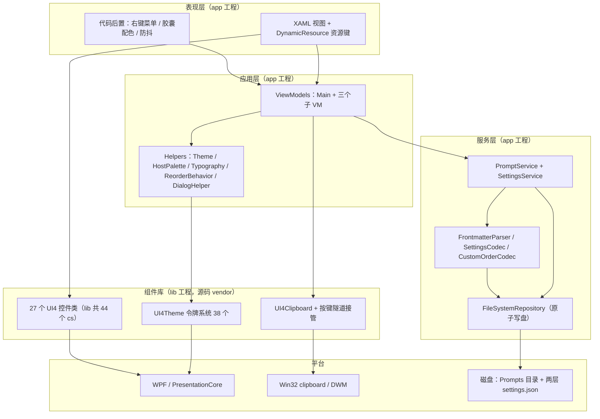

---

## 三、项目架构

### 3.1 分层与依赖方向

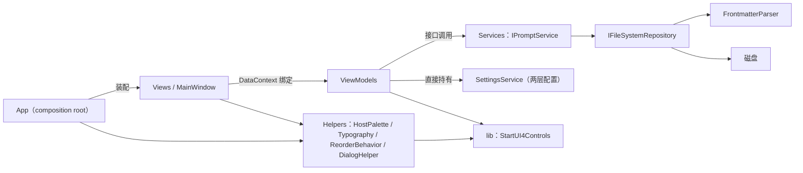

依赖方向的**规范**：`Views → ViewModels → Services → 磁盘`，`Helpers` 与 `Converters` 可被 Views/App 引用，`Services` 不引用 `ViewModels`。

**四条有意的例外**（记在这里，免得后来者当 bug 修）：

1. **ViewModel 直接调库的 UI 服务**——`MainViewModel` 里出现 `UI4MessageBox.Show` 与 `UI4Clipboard.TrySetTextAsync`（`ViewModels/MainViewModel.cs:337`、`:397`）。取舍理由：弹窗与剪贴板是"动作的结果"，不为它们再抽一层抽象。
2. **View 代码后置直接调 ViewModel 的方法**——右键菜单项的回调走 `vm.RenameEntry(...)`、`vm.AddModule(...)`（`Views/EntryListView.xaml.cs:207`、`Views/ModuleListView.xaml.cs:92`）。这些交互是"弹窗取到一个字符串"，不适合做成命令绑定。
3. **`SettingsService` 被三个子 VM 各自持有**——不是只由 `MainViewModel` 转发（`ModuleListViewModel.cs:74-78`、`EntryListViewModel.cs:108-113`、`EntryDetailViewModel.cs:166-170`）。理由：拖动顺序、排序档、折叠态都是那一栏自己的事。
4. **`App` 的静态属性被 View 读**——`MainWindow.xaml.cs:165` 读 `App.Settings.RootSettingsDirectory`，`MainViewModel.DataRootPath` 读 `App.RootPath`（`MainViewModel.cs:191`）。服务定位器就这三个口子（`App.xaml.cs:15-17`）。

### 3.2 工程与产物拓扑

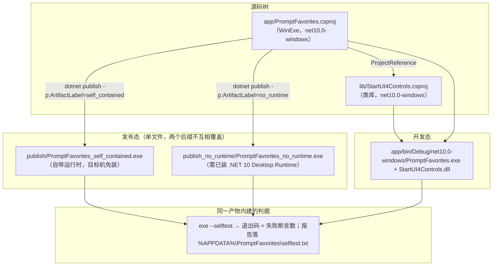

要点：

- **打包开关只在 publish 时生效**：条件属性组挂在 `Condition="'$(PublishSingleFile)' == 'true'"` 上（`csproj:30-41`），所以 `dotnet build` 不要求本机装 win-x64 运行时包。
- **产物名由 `ArtifactLabel` 驱动 `AssemblyName`**（`csproj:48-50`），但**数据根与设置目录是字面量 `PromptFavorites`**，不跟着程序集名变（`SettingsService.cs:123-125`）。
- **`DebugType=embedded` 与 `GenerateDocumentationFile=false` 是全局属性**，会一并作用到被引用的 `lib` 工程，因此输出目录只剩一个 exe，而库内异常堆栈仍带行号。
- **单文件压缩只对自包含合法**：`EnableCompressionInSingleFile` 按 `SelfContained` 分档，框架依赖强开会报 `NETSDK1176`（`csproj:35`）。
- **自包含首启要解原生库到 `%TEMP%\.net\<产物名>\`**（`IncludeNativeLibrariesForSelfExtract`，`csproj:39`）；框架依赖版什么都不解。

### 3.3 存储拓扑

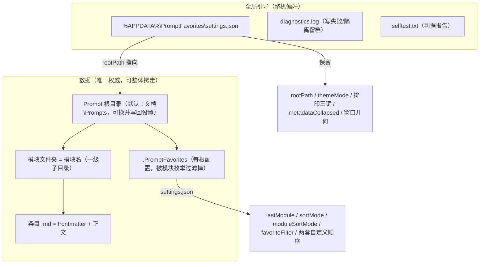

**两层划分的判据是一句话**：「换个根目录，这个值还有没有意义」（`SettingsService.cs:148-162`）。`lastModule` 与两套顺序按**模块名**记账，只在某个根下成立；外观与窗口几何是整机偏好。拆层修的实问题：换根后上一个根的状态仍留在内存里，下一次 `Save()` 整体盖回去，同名模块还会直接串顺序（`SettingsService.cs:19-22` 的类注释）。

三条连带约定：

- `.PromptFavorites` 是保留名，新建与改模块名都会拒绝它（`ModuleListViewModel.cs:192-200`），且它从模块枚举里被过滤（`FileSystemRepository.cs:30`）——否则左栏凭空多一项，删掉等于把这一根的视图配置删了。
- 根不可写（只读盘、离线同步盘）时**配置不清零**：数据键继续留在全局文件里当副本，设置面板"设置目录（当前根）"那行标注回退态（`SettingsService.cs:26-27`、`:317-347`；`MainViewModel.cs:196-205`）。
- 每根配置文件里的 `rootPath` 一律忽略（`SettingsService.cs:389-398`）——它是引导指针，只能存在固定位置，否则两个根会互相指到对方身上。

### 3.4 架构决策与它换来的代价

| 决策 | 换来的好处 | 接受的代价 |
|---|---|---|
| 无数据库、纯文件 | 备份即复制；外部工具可读写；程序坏了数据还在 | 搜索是全盘 `ReadAllText`；条目很多时靠 300 ms 防抖扛 |
| 名字是权威、frontmatter 是副本 | 用户在资源管理器里改名不会让程序读不出来 | 改名分两步，中途失败要靠启动扫描自愈（§8.2） |
| 顺序按名字记在本地配置，不写进文件 | 拷到别的机器、外部改名都不会让整表错位 | 顺序不跟数据走，换机器要重排 |
| 未知 frontmatter 键原样保留 | 与 Obsidian 之类工具共存不互相吞字段 | 写盘顺序固定"已知在前、未知在后"，不重排（`FrontmatterParser.cs:123-125`） |
| 主题两档都注册 | 切档即时、不必重启 | 注册两份字典，启动多写一次资源 |
| 缩放走 `LayoutTransform` | 放大不裁切（先除系数再变换） | 窗口下限要按系数折算；Popup 不吃这层（§8.6） |
| 判据内建在产物里（`--selftest`） | 打包后的 exe 自己就是测试运行器，发布脚本能拿退出码守门 | 判据代码占 `app/` 源码 1,590 行（四段各一文件 + 合成入口 `SelfTest.cs`），约占总量的 20% |

### 3.5 生命周期骨架

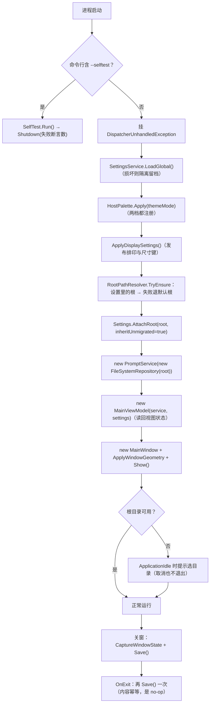

**这里立着一条硬不变量**：`OnStartup` 无论数据准备成功与否，都必须以"有可见窗口"或"明确退出进程"结束（`App.xaml.cs:63-78`）。它对着的是那次 16 MB 事故——`ShutdownMode="OnMainWindowClose"`（`App.xaml:7`）加上 `MainWindow` 为 null，退出条件永不满足，进程活着但没窗口。连窗口都创建不了时才 `Shutdown(-2)`。

---

## 四、代码地图

`app/` 共 46 个文件 / 7,830 行（38 个 `.cs` + 6 个 `.xaml` + `PromptFavorites.csproj` + `app.manifest`，另有 `AppIcon.ico` 与 `快速启动.txt`）；`lib/` 共 44 个 `.cs`（38 个顶层 + 6 个 `Internal/`）/ 15,734 行。

### 4.1 顶层结构

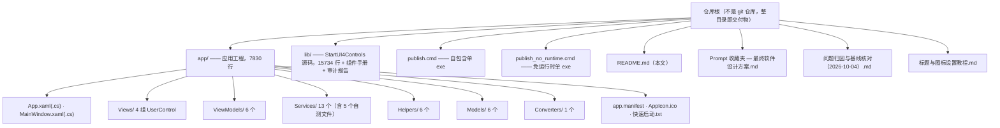

### 4.2 `app/` 逐文件清单

**入口与外壳**

| 文件 | 行 | 职责 | 关键成员 |
|---|---|---|---|
| `App.xaml` | 25 | 资源根：5 个转换器实例 + 收藏语义色刷子；`ShutdownMode=OnMainWindowClose` | `App.Brush.Favorite`、`App.Brush.FavoriteHover` |
| `App.xaml.cs` | 219 | composition root + 启动不变量 + 换根 | `OnStartup:19`、`ApplyDisplaySettings:92`、`ChangeRootPath:104`、`ApplyWindowGeometry:152`、`OnDispatcherUnhandledException:189` |
| `MainWindow.xaml` | 139 | 顶栏 + 三栏 + Toast + 设置浮层；根 `LayoutTransform` 缩放 | 列宽 240 / Auto / 300 / Auto / `*`（`:77-83`） |
| `MainWindow.xaml.cs` | 230 | Toast 动画、搜索防抖、目录按钮菜单、Esc、关窗落盘 | `_searchDebounceTimer:32`、`ShowToast:85`、`FolderBtn_Click:132`、`OpenSettingsFolder:163` |
| `PromptFavorites.csproj` | 55 | 目标框架、版本、图标、条件化单文件发布属性组 | `ArtifactLabel:48-50` |
| `app.manifest` | 22 | PerMonitorV2 DPI 感知与 OS 兼容列表 | `:18-19` |
| `AppIcon.ico` | — | 7 挡 16/24/32/48/64/128/256 | 生成脚本未随包交付 |
| `快速启动.txt` | 69 | 命令口径与批次实测记录、已知未修项 | — |

**Views/ —— 四个 UserControl**

| 文件 | 行(XAML+cs) | 职责 | 值得注意的实现 |
|---|---|---|---|
| `ModuleListView.xaml(.cs)` | 94 + 180 | 左栏：标题、三个排序胶囊、模块列表 | 右键菜单在 `Loaded` 建、`Unloaded` 拆（`:24-48`）；`PaintChip` 用 `SetResourceReference` 而不是本地赋色（`:170-178`） |
| `EntryListView.xaml(.cs)` | 135 + 224 | 中栏：收藏胶囊、五个排序胶囊、条目列表、行内星标与快速复制 | 头部 `Grid(* + Auto)` 里 `StackPanel` 装收藏胶囊与 `WrapPanel`，两者严格等宽（`:22-77` 的注释记录了两条不成立的方案） |
| `EntryDetailView.xaml(.cs)` | 123 + 145 | 右栏：元数据折叠区、正文编辑、复制/保存；`Ctrl+S` | `BodyEditor.Text` 与 `VM.BodyText` 用 `_isSyncing` 双向防回环（`:58-88`）；保存按钮可用性由 `CanSave` 通知驱动（`:138-143`） |
| `SettingsOverlay.xaml(.cs)` | 177 + 44 | 设置面板四节：应用信息 / 配色 / 字体 / 全局缩放 | 区间与默认值只从 `x:Static Typography.*` 来，代码后置不写第二份常量（`:25-36`） |

**ViewModels/**

| 文件 | 行 | 职责 | 关键成员 |
|---|---|---|---|
| `ViewModelBase.cs` | 23 | `INotifyPropertyChanged` + `SetProperty` | `:10-21` |
| `RelayCommand.cs` | 65 | `RelayCommand` / `RelayCommand<T>`，`CanExecuteChanged` 挂 `CommandManager.RequerySuggested` | `:17-21` |
| `MainViewModel.cs` | 469 | 三栏编排、搜索、复制编排、设置面板的三组可绑定值、只读应用信息、窗口状态采集 | `OnModuleSelected:283`、`OnEntrySelected:294`、`CopyToClipboard:395`、`CaptureWindowState:443` |
| `ModuleListViewModel.cs` | 269 | 模块集合、三种排序、可见顺序与配置快照、保留名判定 | `RefreshModules:118`（静默还原选中项）、`CommitManualOrder:152`、`IsReservedName:192` |
| `EntryListViewModel.cs` | 294 | 条目集合、收藏筛选、五种排序、拖动态判定、搜索态 | `CanReorder:76`、`RefreshDisplay:234`、`ApplyFavoriteToView:182` |
| `EntryDetailViewModel.cs` | 317 | 编辑态与脏判定、收藏双向联动、模块下拉、保存 | `HasChanges:118`、`_suppressFavoriteWrite:19`、`LoadEntry:178`、`Save:259` |

**Services/**

| 文件 | 行 | 职责 |
|---|---|---|
| `IPromptService.cs` / `IFileSystemRepository.cs` | 28 / 25 | 两层契约：面向业务的 19 个方法 / 面向磁盘的 16 个方法 |
| `PromptService.cs` | 333 | 业务编排：模块与条目的增删改移、搜索、排序、复制计数；`SaveEntry:123` 是"先继承磁盘未知键再写"的所在地 |
| `FileSystemRepository.cs` | 195 | 目录枚举与原子写盘：`WriteAtomic:78`、`MoveEntry:144`（撞目标抛 `IOException`）、`GetModuleNames:21`（过滤 `.PromptFavorites`） |
| `FrontmatterParser.cs` | 132 | `Parse:14` 找第二个 `---`；`Serialize:110` 固定 7 个已知键 + 未知键追加 |
| `SettingsService.cs` | 645 | 两层配置的唯一实现：`RootScopedKeys:154`、`AttachRoot:212`、`Save:317`、`Quarantine:546`、`TryWriteFile:576` |
| `SettingsCodec.cs` | 186 | kv1 编解码 + 旧 JSON 一次性读取 + `CollapseSeparators:141` |
| `CustomOrderCodec.cs` | 143 | 顺序文本编解码（分隔符取文件名非法字符）与 `Apply:94` 排序应用 |
| `SelfTest.cs` | 116 | `--selftest` 合成入口、`SelfTestResult` 断言收集器、报告落 `%APPDATA%` |
| `SettingsSelfTest.cs` | 393 | 段 `settings`：kv1 往返与体积、旧 JSON、枚举按键名、顺序编解码、两层键归属（`CheckTwoTierOwnership:272`） |
| `ThemeSelfTest.cs` | 211 | 段 `theme`：38 令牌齐全、明暗两档覆盖、应用后资源键与色表同源、7 项对比度门槛 |
| `DataSelfTest.cs` | 505 | 段 `data`：frontmatter 保真、仓储读写、模块变更通知、配置目录隔离（`:39`）、两层端到端（`:73`） |
| `DisplaySelfTest.cs` | 365 | 段 `display`：库兜底键、宿主覆盖换档仍有效、层级键全发布、固定件尺寸、阶梯单调、`ZoomedSizeConverter`、两块 XAML 可解析 |

**Helpers/ 与 Converters/**

| 文件 | 行 | 职责 |
|---|---|---|
| `Theme.cs` | 60 | **源色单源**：两档各一组语义色 + 收藏金（三批都改不到这里就不必重排色表） |
| `HostPalette.cs` | 226 | 源色 → 每档 38 令牌的派生表 + 注册 + Toast 反色刷子 + 对比度算式 |
| `Typography.cs` | 146 | 排印单源：默认值/区间/层级换算/固定件尺寸/候选表/资源键发布 |
| `RootPathResolver.cs` | 89 | 根目录归一化与校验，保证不抛异常（`:8-11`）；上限 240（`:18`） |
| `ReorderBehavior.cs` | 314 | 附加属性式行内拖动：`DragController` 算落点间隙、画插入线、自动滚动，落点交 `CommitCommand` |
| `DialogHelper.cs` | 129 | 纯代码构造的输入对话框；所有色都走 `SetResourceReference`（`:20-22`） |
| `Converters.cs` | 125 | 5 个在用转换器 + `ZoomedSizeConverter`（`:82`）+ 2 个零引用（§4.6） |

### 4.3 `lib/` 的使用面

44 个 `.cs` 分成四族，本项目实际只碰得到第一、二族的子集：

| 族 | 成员 | 本项目 |
|---|---|---|
| 主题族 | `UI4Theme`、`UI4ThemeDefinition`、`UI4ThemeToken`、`UI4ThemePacks`、`UI4ThemeScope`、`UI4ThemePersistence` | 用 `UI4Theme.Register/SetTheme`、`UI4ThemeDefinition.Light/Dark/With`、`UI4ThemeToken`；**不用** `UI4ThemePacks`/`UI4ThemeScope`/`UI4ThemePersistence` |
| 控件族 | 27 个 `FrameworkElement` 派生的 `UI4*` 类（`UI4Button`、`UI4CheckBox`、`UI4CircleSlider`、`UI4CodeEditor`、`UI4ColorPicker`、`UI4ComboBox`、`UI4FlipTextBlock`、`UI4Grid`、`UI4GridView`、`UI4ListBox`、`UI4ListView`、`UI4Menu`、`UI4MessageBox`、`UI4NavigationView`、`UI4NotifyIcon`、`UI4Panel`、`UI4PasswordBox`、`UI4Pivot`、`UI4ProgressBar`、`UI4ProgressRing`、`UI4Radio`、`UI4ScrollViewer`、`UI4Slider`、`UI4Switch`、`UI4Tab`、`UI4TextBlock`、`UI4TextBox`） | 用 7 类（§5.4） |
| 服务族 | `UI4Clipboard`、`UI4ContextMenu` 与 `UI4MenuItem`（两者是普通类，不是控件）、`UI4MultiLanguage`、`UI4WindowTitleBar` | 用前两个；`UI4WindowTitleBar` 只被主题系统内部驱动 |
| Internal 族 | 6 个（`ThemeSync`、`ClipboardCommandTakeover`、`WindowAnimationHelper`、`WindowResizeBehavior`、`ColorToBrushConverter`、`ScrollBarResources`） | 全部由库内部使用 |

文档两份：`lib/README.md`（2165 行组件手册）与 `lib/架构审计报告-3.0.0主题机制评审.md`（662 行）。**手册与源码有 5 处不一致**，其中两条会影响读者判断（§4.6）。

### 4.4 找东西去哪儿（速查表）

| 要改的事 | 唯一落点 |
|---|---|
| 调色 | `Helpers/Theme.cs` 的源色常量（不要抄到别处） |
| 加/改主题令牌映射 | `Helpers/HostPalette.cs` 的 `LightTokens`/`DarkTokens` |
| 字号默认值、区间、层级差值 | `Helpers/Typography.cs` |
| 加一个设置键 | `SettingsService`：属性 + `ToMap` + `ApplyMap`，若属"跟着根走"再进 `RootScopedKeys`，最后在 `SettingsSelfTest` 补键名一致断言 |
| 改 frontmatter 字段 | `Models/FrontmatterData.cs` + `Services/FrontmatterParser.cs` 的读写两处 |
| 排序规则 | 中栏 `EntryListViewModel.RefreshDisplay` + `PromptService.ApplySort`；左栏 `ModuleListViewModel.RefreshModules` |
| 窗口默认/最小尺寸 | `MainWindow.xaml:8-10`（最小值经 `ZoomedSizeConverter` 折算） |
| 三栏宽度 | `MainWindow.xaml:77-83` |
| 圆钮/胶囊尺寸 | `Typography.RoundButtonSize` / `ChipHeight` |
| 复制行为与计数 | `MainViewModel.CopyToClipboard/FinishCopy` |
| 剪贴板本身 | `lib/UI4Clipboard.cs`（改组件库源码前要征求意见） |
| 右键菜单 | `Views/*.xaml.cs` 的 `Loaded` + `MainWindow.xaml.cs:132` |
| 自测判据 | 对应那一段的 `*SelfTest.cs` |
| 打包产物名/体积开关 | `app/PromptFavorites.csproj:30-50` + 两个 `publish*.cmd` |

### 4.5 批次落点（哪些改动在哪个文件）

| 批次 | 主落点 |
|---|---|
| 基线对齐 | `lib/` 逐文件对齐包内基准，`app/` 未动 |
| 明暗双档 + 色源收敛 | `Helpers/Theme.cs`、`HostPalette.cs`、`ThemeSelfTest.cs`、各 `Views/*.xaml` 的取色 |
| 写盘原子化 + frontmatter 保真 | `FileSystemRepository.WriteAtomic`、`PromptService.SaveEntry`、`DataSelfTest.cs` |
| 设置浮层 + 排印通路 | `Views/SettingsOverlay.xaml(.cs)`、`Helpers/Typography.cs`、`MainViewModel.cs`、`lib/` 的 6 处引用点 + `UI4Theme.WriteTokens` |
| 观感修正（列宽/内缩/等宽） | `MainWindow.xaml:77-83`、`Views/EntryListView.xaml:22-77`、`Views/ModuleListView.xaml:14-56` |
| 圆钮与胶囊随字号长 | `Typography` 的尺寸派生 + 四处 `DynamicResource App.Size.*` |
| 字体候选表首位钉死 | `Typography.BuildFamilyChoices`、`MainViewModel.SelectedFontFamily/ResolveFamilyEntry` |
| 两层配置 | `SettingsService.cs`（`RootScopedKeys`/`Partition`/`AttachRoot`/`Save`）、`FileSystemRepository.GetModuleNames`、`DataSelfTest.CheckTwoTierStorage` |

### 4.6 零引用点与手册失真（按代码为准）

- **`Converters.cs` 里两个转换器是死码**：`InverseBoolConverter`（`:34`）与 `SortModeMatchConverter`（`:108`）既没在 `App.xaml` 注册为资源，也没有任何 XAML 引用它们；`App.xaml:9-13` 只挂了 5 个在用的。要加转换器，必须先在 `App.xaml` 注册，否则 `StaticResource` 取不到、绑定静默失效。
- **`lib/README.md:1698` 说的标题栏通路②在源码里没有调用点**：`UI4WindowTitleBar.NotifyContentLoaded`（`lib/UI4WindowTitleBar.cs:77`）全库仅定义、无调用。本项目的原生标题栏跟着主题变，走的是另一条——`UI4Theme` 静态构造里订阅 `ThemeChanged → ApplyOpenWindows()`（`lib/UI4Theme.cs:66-70`、`:114-119`）。
- **`lib/README.md:1820` 的剪贴板示例用了不存在的 API**：公开面只有 `TrySetTextAsync` / `TryGetTextAsync` / `ContainsText`（`lib/UI4Clipboard.cs:60,76,102`），没有同步的 `TrySetText`。应用调的是 `TrySetTextAsync`（`ViewModels/MainViewModel.cs:397`）。
- **`UI4PasswordBox` 不能用 `ClipboardCommandTakeover.Install(this)`**：它从自己的 `OnPreviewKeyDown` 里调 `TryHandleKey`（`lib/UI4PasswordBox.cs:395`，且仅 `!IsPasswordMode` 时，`:391-397`）。手册 `:361` 把它写成了通用范式。
- **本项目对 `lib/` 的排印偏离是 8 个文件**：6 个控件的字号引用点 + `UI4Theme.cs` 的三个兜底键 + `lib/README.md` 的 §4.2.1（见 §5.4）。

---

## 五、组件架构

### 5.1 UI 组件树

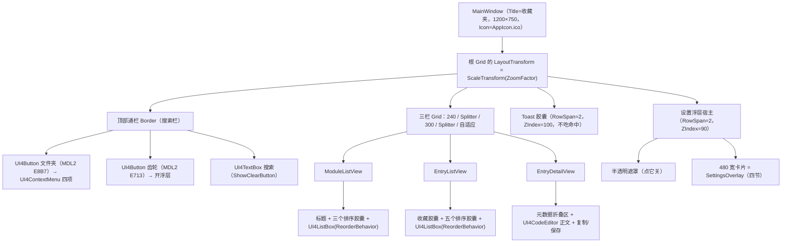

### 5.2 组件 ↔ ViewModel ↔ 绑定契约

| 组件 | DataContext | 绑定的属性/命令 | 代码后置负责的事 |
|---|---|---|---|
| `MainWindow` | `MainViewModel` | `SearchText`、`IsSettingsOpen`、`ZoomFactor`（两处：`LayoutTransform` 与 `MinWidth/MinHeight`） | Toast 动画、300 ms 防抖、目录菜单、Esc、关窗落盘 |
| `ModuleListView` | `Modules` | `Modules`、`SelectedModule`、`AddModuleCommand`、`ReorderCommand`、`CanReorder` | 右键菜单（重命名/删除）、排序胶囊配色、新建模块弹窗 |
| `EntryListView` | `Entries` | `Entries`、`SelectedEntry`、`AddEntryCommand`、`QuickCopyCommand`、`ToggleEntryFavoriteCommand`、`ReorderCommand`、`CanReorder`、`IsFavoriteFilter` | 五个排序胶囊与收藏胶囊的选中态、右键菜单、行内星标与复制按钮的事件转发 |
| `EntryDetailView` | `Detail` | `EditTitle`、`EditModule`、`BodyText`(手动同步)、`IsFavorite`、`UseCount`、`CreatedAt`、`UpdatedAt`、`MetadataSummary`、`HasEntry`/`IsEmpty`、`SaveCommand`、`CopyCommand` | 编辑器与 VM 的双向防回环、元数据折叠可见性、收藏按钮文案与配色、保存按钮可用性 |
| `SettingsOverlay` | `MainViewModel`（继承宿主） | `AppVersion`、`RuntimeVersion`、`LibraryVersion`、`DataRootPath`、`SettingsFolder`、`GlobalSettingsFolder`、`ThemeModeSwitchLabel`、`AvailableFonts`/`SelectedFontFamily`、`BaseFontSize`、`ZoomPercent` | 四个按钮各调一个 VM 方法，不写常量 |

两个刻意**不用绑定**的地方：`BodyEditor.Text`（`UI4CodeEditor` 的 `Text` 与 VM 属性用事件双向同步并加 `_isSyncing` 闸门，`Views/EntryDetailView.xaml.cs:58-88`）；排序/筛选胶囊的选中态（走 `Click` + `PaintChip`，因为选中态要同时改两把渐变刷和一个前景清值）。

### 5.3 ViewModel 协作（事件式，无 Mediator）

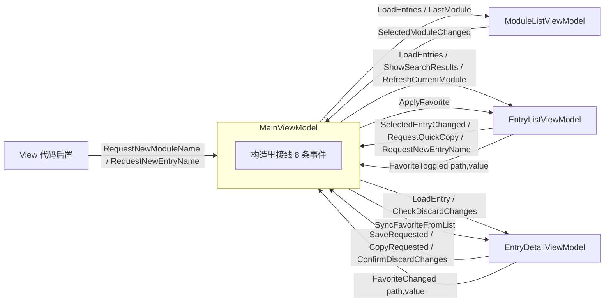

事件清单与存在理由：

| 事件 | 方向 | 为什么不是绑定 |
|---|---|---|
| `SelectedModuleChanged` | 左栏 VM → Main | 切模块要连着做"未保存检查 + 加载中栏 + 记 `lastModule`"三件事（`MainViewModel.cs:283-292`） |
| `SelectedEntryChanged` | 中栏 VM → Main | 只有路径真变了才重读盘，否则会把编辑器里未保存的改动冲掉（`:303-310`） |
| `SaveRequested` / `CopyRequested` | 右栏 VM → Main | 保存后要刷新中栏与左栏计数；复制要跨到剪贴板与计数 |
| `ConfirmDiscardChanges` | Main → 右栏 VM（`Func<bool>`） | 弹窗在 Main 侧统一口径（`:432-440`） |
| `FavoriteToggled` ↔ `FavoriteChanged` | 中栏 ↔ 右栏，经 Main 转发 | 两个入口各持**不同的 `PromptItem` 实例**，必须按文件路径双向同步（`:237-240`，§8.3） |
| `RequestQuickCopy` | 中栏 VM → Main | 快速复制要走与右栏同一套"有未保存更改"检查 |
| `ToastRequested` | Main → MainWindow | 轻提示是窗口动画，属于 View |
| `RequestNewModuleName` / `RequestNewEntryName` | 子 VM → View | 需要弹代码构造的输入框取字符串，是 View 的活 |

### 5.4 控件库使用面（7 类控件 + 3 项服务）

| 库成员 | 用在哪 | 承担的交互 |
|---|---|---|
| `UI4Button` | 21 个 XAML 站点：顶栏 2、左栏 4、中栏 7、右栏 4、面板 4 | 渐变底 + 自动字色判据（§8.7）；圆钮与胶囊尺寸吃 `App.Size.*` 资源键 |
| `UI4ListBox` | 左栏与中栏列表 | `ListStyleType=None`，选中行两把色显式绑 `UI4.Color.RowSelectedBackground`/`TextForeground`；挂 `ReorderBehavior` |
| `UI4TextBox` | 搜索框、元数据标题框、对话框输入框 | 占位文本与清除按钮；`Ctrl+C/X/V` 被库内按键隧道接管 |
| `UI4ComboBox` | 右栏模块下拉、面板字体下拉 | 候选表首位规则见 §8.11 |
| `UI4CodeEditor` | 右栏正文编辑区 | AvalonEdit 内核；关语法高亮与行号（`Views/EntryDetailView.xaml.cs:29-30`）；字号绑 `UI4.Font.Size.Code` |
| `UI4Slider` | 字号滑杆、缩放滑杆 | `Minimum/Maximum` 走 `x:Static Typography.*` |
| `UI4ContextMenu` | 目录按钮菜单、两栏右键菜单 | 已知未修：长文案被裁（§8.13） |
| `UI4MessageBox` | 全部提示与确认 | 应用侧唯一的模态出口 |
| `UI4Clipboard` | 复制动作 | `TrySetTextAsync`，失败提示留在应用层（`MainViewModel.cs:397-410`） |
| `UI4Theme` / `UI4ThemeDefinition` / `UI4ThemeToken` | `HostPalette.Apply` | 两档注册 + 切档 |
| `UI4WindowTitleBar` | 不直接调 | 由 `UI4Theme.ThemeChanged` 驱动，原生标题栏与正文一起改观感 |

**本项目对 `lib/` 的全部代码偏离（8 个文件，都是排印通路）**：

| 文件:行 | 改了什么 |
|---|---|
| `lib/UI4Button.cs:137` | 样式 Setter 的 `FontSize` 由字面常量改为 `DynamicResource UI4.Font.Size.Base` |
| `lib/UI4TextBox.cs:161` | `SetResourceReference(FontSizeProperty, "UI4.Font.Size.Base")` |
| `lib/UI4ComboBox.cs:193` | 同上 |
| `lib/UI4ListBox.cs:251` | 同上 |
| `lib/UI4PasswordBox.cs:237` | 同上 |
| `lib/UI4CodeEditor.cs:37` | `SetResourceReference(FontSizeProperty, "UI4.Font.Size.Code")` |
| `lib/UI4Theme.cs:379-384` | `WriteTokens` 随每份主题字典发布三个排印兜底键（`Base=15`、`Code=14`、`Family="Segoe UI"`，常量在 `:388-394`） |
| `lib/README.md` | 新增 §4.2.1 记录排印键契约 |

兜底键这一条要紧：**库内控件模板引用的就是这些键，宿主没发布覆盖值时它们必须解析得到**，否则所有 `UI4*` 控件静默掉到 WPF 裸默认 12 px（§8.5）。

### 5.5 主题组件的分层

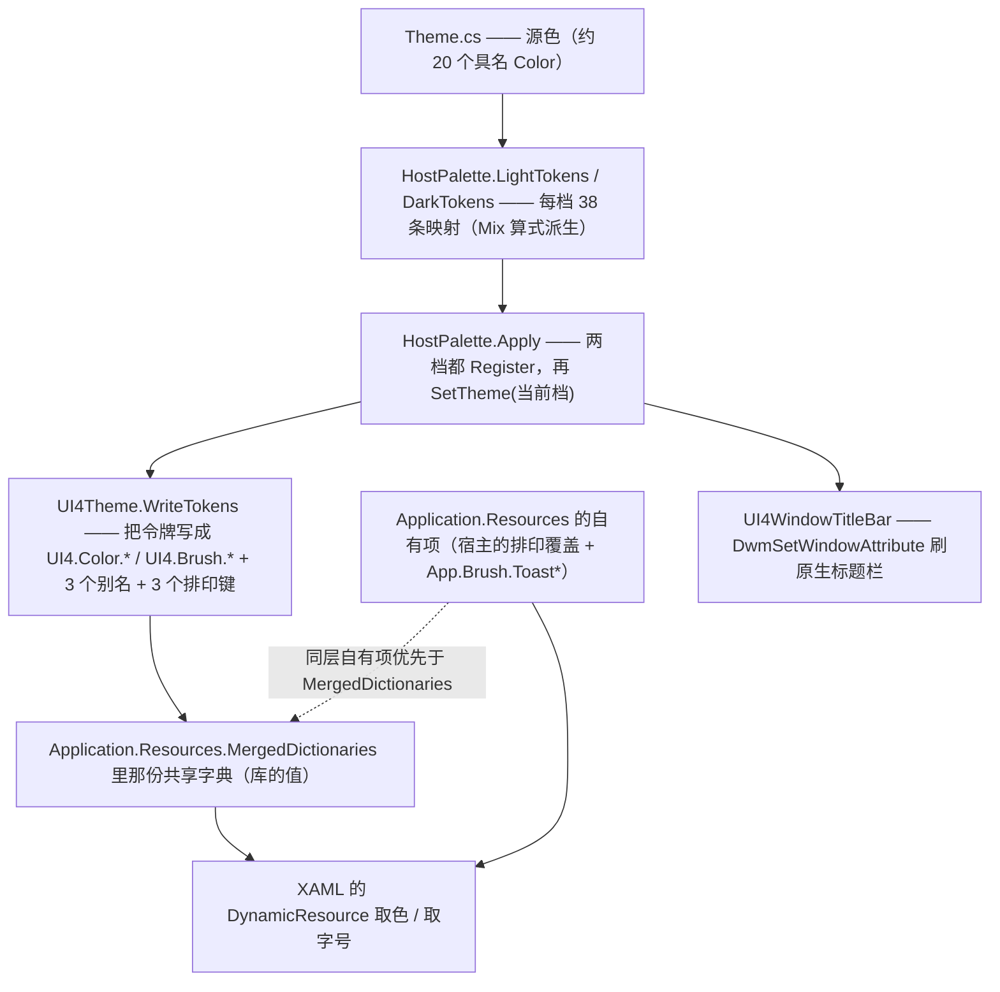

优先级这条（虚线）是整套配色能成立的关键：**库的值住在 `MergedDictionaries`，宿主覆盖写在 `Application.Resources` 的自有项上，同一层自有项优先**——所以换主题不会冲掉宿主写的排印键。这是 `DisplaySelfTest.CheckHostOverrideSurvivesModeSwitch`（`app/Services/DisplaySelfTest.cs:136`）实测钉住的，不是从文档推的。

### 5.6 自建的行为与辅助组件

| 组件 | 类型 | 契约 |
|---|---|---|
| `ReorderBehavior.Enabled` / `.CommitCommand` | 附加属性（`Helpers/ReorderBehavior.cs:38-44`） | 只在 `Enabled=true` 时接管左键拖动；落点算成"第几道行间隙"，用 `ReorderRequest(item, gap)` 交给命令，**自己不碰集合** |
| `InsertionAdorner`（同文件内部类） | Adorner | 画插入线、跟随间隙换宿主容器、贴边时自动滚动 |
| `DialogHelper.ShowInputDialog` | 静态方法 | 纯代码建窗口，一切颜色走 `SetResourceReference`，否则对话框开着时切档就定在旧档上（`:20-22`） |
| `ZoomedSizeConverter` | `IValueConverter` | 入参形如 `W:900` / `H:500`，出参 = `min(设计值 × 系数, 工作区对应边)`；参数写错必须回 `UnsetValue`（`Converters.cs:84-100`） |
| `BoolToStar` / `BoolToVis` / `UseCountDisplay` / `DateTimeFormat` | 转换器 | 只在 XAML 显示层用，不参与业务判断 |
| `SelfTestResult` | 断言收集器 | `Check` 每调一次记一组，所以报告里的组数 = 实际跑过的断言数（`Services/SelfTest.cs:87-115`） |

---

## 六、数据流图

### 6.1 启动时序

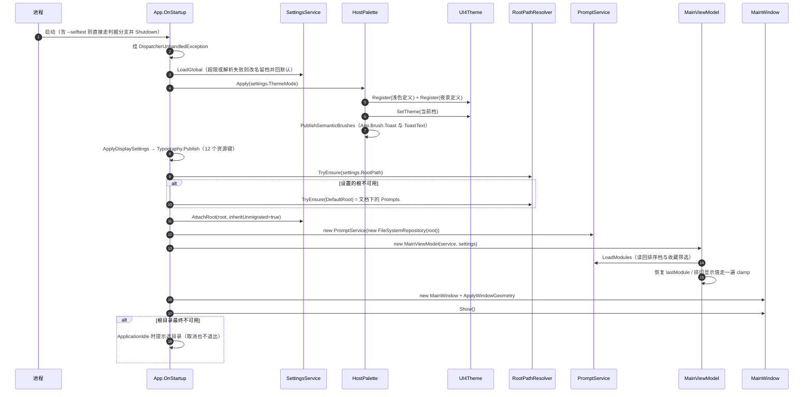

顺序上有两处**不能换位**：`HostPalette.Apply` 必须在 `base.OnStartup` 之后且在第一个窗口 `Show()` 之前（库写回资源字典的第一句是 `Application.Current == null` 则 return，早一步会静默不装字典，`App.xaml.cs:34-38`）；`AttachRoot` 必须在 `new MainViewModel` 之前，因为那个构造函数要读回 `lastModule`、排序档、收藏筛选（`:46-50`）。

### 6.2 读路径（磁盘 → 屏幕）

```mermaid
flowchart LR
  D["模块目录 与 .md 文件"] --> R1["FileSystemRepository.GetModuleNames / GetEntryFiles"]
  R1 --> R2["ReadEntry：ReadAllText(UTF8 无 BOM)"]
  R2 --> P1["FrontmatterParser.Parse → FrontmatterData + body"]
  P1 --> P2["缺字段兜底：Title 取文件名、Module 取目录名、CreatedAt 取文件创建时间、UpdatedAt 取 CreatedAt"]
  P2 --> S1["PromptService.LoadModules / LoadEntries / LoadEntryDetail"]
  S1 --> S2["PromptItem（含 Body）/ PromptModule（含 EntryCount）"]
  S2 --> V1["EntryListViewModel._allEntries（全量）"]
  V1 --> V2["RefreshDisplay：收藏筛选 → 排序 → Clear/Add 重建 Entries"]
  V2 --> U1["UI4ListBox.ItemsSource 双向绑定 SelectedEntry"]
  U1 --> U2["DataTemplate：Title / UseCount 转换器 / 星标按钮"]
  U1 -->|选中| S3["LoadEntryDetail 再读一次盘"]
  S3 --> V3["EntryDetailViewModel.LoadEntry（回填编辑态并记下三个 original）"]
```

**两级集合**是这条通路的核心结构：`_allEntries` 是磁盘视图，`Entries` 是"筛选 + 排序之后"的可见视图，每次可见性规则变化都整表重建（`EntryListViewModel.cs:234-250`）。重建的副作用是 `UI4ListBox` 会经双向绑定把 `SelectedEntry` 回写成 null，所以凡是重建之后都要显式把选中项按同名/同路径还原回去（`EntryListViewModel.cs:182-193`、`ModuleListViewModel.cs:118-149`）——这是 §8.11 第一条静默失效。

### 6.3 写路径（保存）

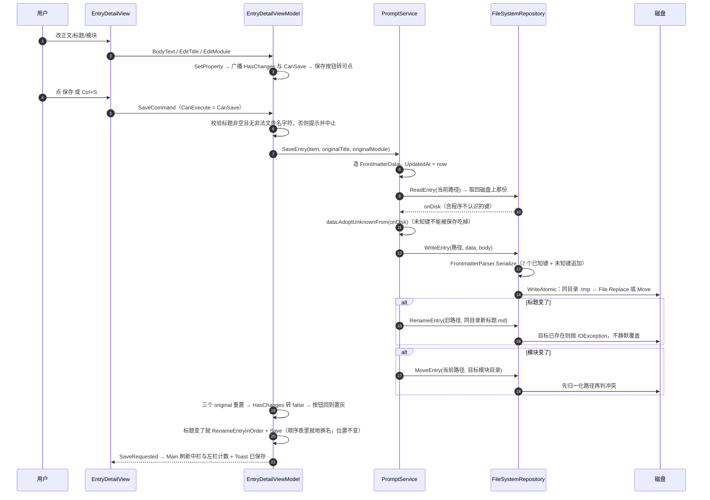

改名与移动的**顺序是刻意的**：正文先写成功，再改名/移动（`PromptService.cs:143-164`）。中途失败会出现"正文已写、名字未改"，下一次读入时靠缺字段兜底不至于读不出（§6.9）。

### 6.4 复制路径（含跨线程往返）

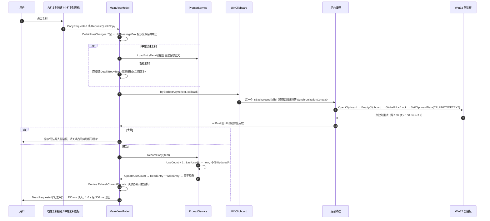

关于"列表不立即重排"：设计方案 §10 要求复制后不重排避免视觉跳动，而当前实现里 `FinishCopy` 调了 `RefreshCurrentModule()`（`MainViewModel.cs:413-418`）——它会重读盘并按 `useCount` 重排，被复制的那条会跳到首位。**这是当前事实**，按 `useCount` 降序档时表现为"点复制→这条跑到最上面"。

### 6.5 设置读写流（两层归属）

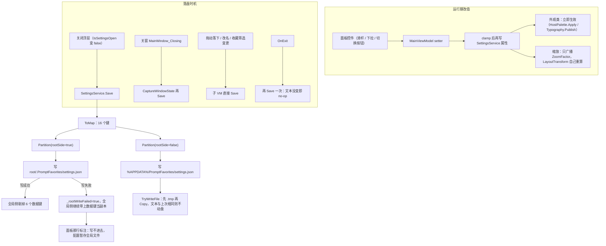

判据口径：`RootScopedKeys` 是**唯一出处**，写侧与读侧都从它派生（`SettingsService.cs:148-162`、`:507-516`），于是"某个键两边都写"或"两边都不写"这类漂移会被 `SettingsSelfTest.CheckTwoTierOwnership` 抓住。滑杆每动一格就写盘会把用户同时手改的其它键一起冲掉，也是无谓的磁盘 IO——所以**只在关浮层时写一次**（`MainViewModel.cs:54-59`）。

### 6.6 明暗切档流

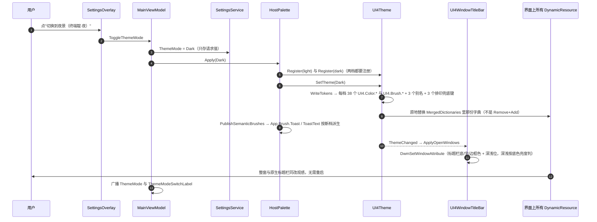

"两档都要注册"这条不是谨慎而是必需：只注册当前档的话，切到另一档时库会回落到它自己的内置定义，夜景就变成库的默认蓝黑了（`HostPalette.cs:31-33`、`:69-78`）。

### 6.7 搜索流

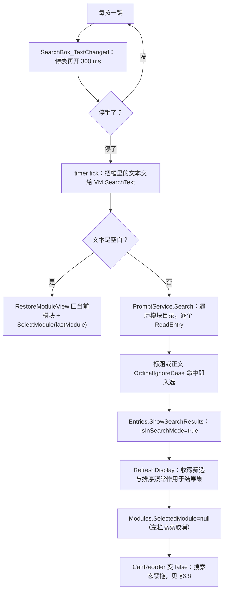

搜索是全盘读文件，没有任何缓存或索引（`PromptService.cs:234-278`）；300 ms 防抖是对着"逐键搜索会把条目多时的耗时叠加成卡顿"加的（`MainWindow.xaml.cs:118`）。

### 6.8 拖动排序流

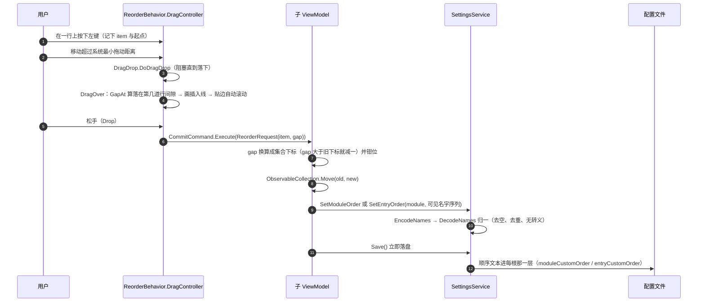

四道闸门决定"能不能拖"：不是 `Custom` 档、处于搜索态、开着收藏筛选、可见行数不足 2——后两条对着同一个风险：那时看到的是**子集**，用子集覆盖整表会打乱未显示项的顺序（`EntryListViewModel.cs:72-85`）。用 `Move` 而不是 `Remove+Insert`，因为后者会把选中行冲成 null、连带重加载中栏甚至弹"有未保存更改"（`ModuleListViewModel.cs:84-104`）。从没拖过的栏直接点"自定义"时以当时看到的顺序为起点、只留内存不写配置，第一次落下才固化（`:43-49`）。

### 6.9 一致性与自愈流

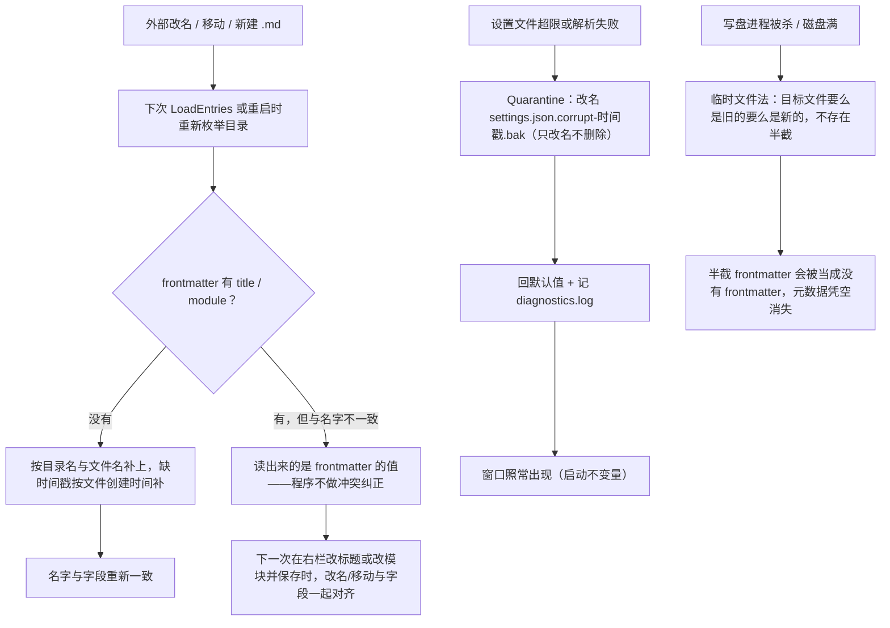

**这里要显式记一条与直觉相反的当前事实**：名字权威只在**字段缺失时**兜底（`FileSystemRepository.cs:53-64`），frontmatter 里已经写了 `title`/`module` 而它与文件名不同时，程序**读出来的是 frontmatter 的值**，不会按文件名覆盖。把两者对齐的时机是用户改名保存的那一刻（`PromptService.SaveEntry`/`RenameEntry`/`RenameModule`）。所以"外部改了文件名而 frontmatter 没跟着改"会让列表显示旧标题，直到下一次保存。

---

---

## 七、工作流程

### 7.1 用户日常动线

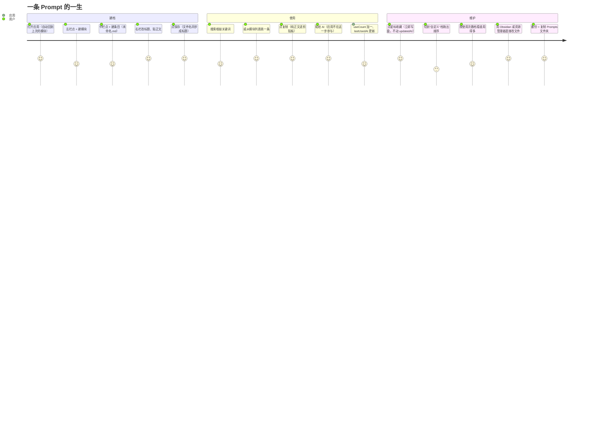

### 7.2 右栏编辑态状态机

```mermaid
stateDiagram-v2
  state "空态（未选中条目）" as Empty
  state "干净（显示与磁盘一致）" as Clean
  state "脏（有未保存更改）" as Dirty
  state "确认放弃更改" as AskDiscard
  state "提示先保存" as AskSave

  [*] --> Clean: 启动并自动选中首条
  Empty --> Clean: 选中条目并 LoadEntry
  Clean --> Dirty: 改 EditTitle / EditModule / BodyText
  Dirty --> Clean: 保存成功（original 三值重置，CanSave 转 false）
  Dirty --> AskDiscard: 点另一条目 / 切模块
  AskDiscard --> Clean: 选"放弃"，丢弃更改并装载新条目
  AskDiscard --> Dirty: 选"取消"，留在原条目
  Dirty --> AskSave: 点复制（右栏或中栏图标）
  AskSave --> Dirty: 选"保存"只保存不复制，需再点一次复制
  AskSave --> Dirty: 选"取消"不保存不复制
  Clean --> Clean: 点复制 → 正文进剪贴板 + 计数 +1
  Clean --> Empty: 删除当前条目
  Dirty --> Dirty: Ctrl+S 与点保存完全等价（同一命令同一可用性）
```

三条可用性判定都只依赖 `HasChanges`（`EntryDetailViewModel.cs:118-132`）：保存按钮、`Ctrl+S`、复制前弹窗。`HasChanges` 是**三个字段各自与 original 比**（标题/模块/正文），收藏不计入——收藏是"立即写盘"的独立通路。

### 7.3 收藏的双入口联动

```mermaid
sequenceDiagram
  autonumber
  participant L as 中栏星标
  participant LVM as EntryListViewModel
  participant M as MainViewModel
  participant DVM as EntryDetailViewModel
  participant R as 右栏收藏按钮
  participant PS as PromptService
  L->>LVM: ToggleEntryFavoriteCommand(item)
  LVM->>PS: ToggleFavorite → UpdateFavorite 立即写盘
  LVM->>M: FavoriteToggled(路径, 新值)
  M->>DVM: SyncFavoriteFromList（_suppressFavoriteWrite 防回环）
  DVM->>DVM: 更新 IsFavorite → 按钮文案与配色
  LVM->>LVM: 筛选开着才重建可见集合，否则靠 PromptItem 自身通知刷星标
  R->>DVM: IsFavorite 取反
  DVM->>PS: SetFavorite → 写盘
  DVM->>M: FavoriteChanged(路径, 新值)
  M->>LVM: ApplyFavorite（同路径才处理）
```

为什么必须显式接线而不是靠绑定：两个入口持有的是**不同的 `PromptItem` 实例**（中栏列表项与右栏 `_currentItem` 各读盘一次），不同步的后果是"写盘成功但界面星标与筛选都不更新"（`MainViewModel.cs:237-240`）。装载条目时必须压住写盘与联动事件（`_suppressFavoriteWrite`，`EntryDetailViewModel.cs:178-216`），否则回填显示会反过来覆盖磁盘。

### 7.4 换根目录流程

```mermaid
flowchart TD
  A["目录按钮 → 切换根目录"] --> B["OpenFolderDialog 取新目录"]
  B --> C{"选了同一个？"}
  C -->|是| Z["什么都不做"]
  C -->|否| D["App.ChangeRootPath(newPath)"]
  D --> E["RootPathResolver.TryEnsure：非法/超长/无权限 → 提示失败并中止，不污染已保存设置"]
  E --> F["Settings.Save()：此刻还挂在旧根，写的就是旧根那份"]
  F --> G["RootPath 与 Settings.RootPath 指向新根"]
  G --> H["Settings.AttachRoot(新根, inheritUnmigrated=false)：上一个根的状态绝不能成为新根的起点"]
  H --> I["new PromptService(new FileSystemRepository(新根))"]
  I --> J["new MainViewModel 并换 DataContext"]
  J --> K["重新挂 ToastRequested 与 CaptureWindowState"]
  K --> L["Settings.Save() 把新根的引导键落定"]
```

`inheritUnmigrated` 的两个取值是这次拆两层的关键差别：首挂传 `true`（旧全局里残留的数据键接过来，第一次 `Save` 就落到本根并从全局摘掉，完成静默迁移）；换根传 `false`（`SettingsService.cs:204-212`、`App.xaml.cs:50`、`:120`）。

### 7.5 开发 → 判据 → 交付流程

```mermaid
flowchart TD
  D1["要改的是观感还是机制？"] -->|机制未明| D2["先量清：加判据或做区分性实验，别改"]
  D1 -->|明确缺陷| D3["判据先行：先把能抓出这个缺陷的断言写进对应那段 SelfTest，看它红"]
  D2 --> D3
  D3 --> D4["最小化改实现"]
  D4 --> D5{"改到 lib/ 的组件源码？"}
  D5 -->|是| D6["先征求意见；改完回灌包内基准并记偏离清单"]
  D5 -->|否| D7["只动 app/"]
  D6 --> D8["dotnet build --no-incremental → 0 错误，警告恰好是上游 9 条"]
  D7 --> D8
  D8 --> D9["产物 --selftest → 退出码 = 失败断言数，0 为全通过"]
  D9 --> D10["两档重打包（先删空 publish 与 publish_no_runtime，别拿旧产物验本轮）"]
  D10 --> D11["启动打包版自证：按自己起的 pid 读窗口标题，收掉后无残留进程"]
  D11 --> D12["判据证不住的面（观感、宽度口味）交给用户目测，列出具体挡位"]
  D12 --> D13{"用户验收？"}
  D13 -->|有反馈| D1
  D13 -->|通过| D14["归档结论到文档"]
```

**判据非空洞必须实测自证**——这是本项目对每条新判据的固定要求。历史上做过的负向自证（都按备份逐字节回滚并用 `diff` 确认无输出）：删掉夜景色表里一行 `OnAccent` → 退出码 1 并点名缺哪个令牌；把写侧键名 `baseFontSize` 改成 `baseFontsize` → 退出码 2；删掉库里 `res["UI4.Font.Size.Base"] = DefaultFontSizeBase;` → 退出码 2；在 `Typography.SizeOf` 开头 `return baseSize;` 抹平层级 → 退出码 6；把 `RoundButtonSize` 改回恒返回 28 → 退出码 8，从基准 21 起逐档报"装不下 22 px 的图标字身"。

本机一次完整实测（2026-10-04 22:20）：`dotnet build PromptFavorites.csproj --no-incremental` → `0 个错误`、`9 个警告`（全是上游 `lib` 的 `CS0414`×5 + `CS1574`×4）、6.94 s；`app/bin/Debug/net10.0-windows/PromptFavorites.exe --selftest` → 退出码 `0`、`PASS 断言组=285`，报告带 7 行 `INFO` 实测值（明暗两档色表原值与对比度、固定件尺寸、字号阶梯、字体候选表 93 项）。

### 7.6 本项目沉淀下来的操作约定

| 约定 | 起因 |
|---|---|
| 判据先行、先红后绿 | 改完没人能验，等于没改 |
| 只动被点名的属性，别顺手重构 | 一批反馈里混进无关改动会让验收无法定位 |
| 共有缺陷修在基础组件层，改 `lib/` 源码前先征求同意 | 组件缺陷在宿主各处重复；但库是基线，动它要有回灌口径 |
| 单源优先：新常量不许出现在第二处 | 手抄十六进制与手抄字号就是"这处不跟主题/不跟字号"的成因 |
| 文档里的数字要么实测要么标出处 | 文档口径滞后过：30→38 个令牌、23→285 组断言、5→7 个控件 |
| 目测项要具体到挡位 | "看看观感"无法验收；"字号 20 与 28 两档下加号是否还在正中"可以 |

---

## 八、工作原理

### 8.1 文件即数据：一条目一文件

一个 Prompt = 一个 `.md` = `frontmatter` + `正文`。七行已知元数据由程序维护，正文一个字都不含元数据——所以"复制出来就是能直接粘给 AI 的纯文本"（设计方案 §10）。

```markdown
---
title: 无损转录器
module: 写作
favorite: true
useCount: 42
createdAt: 2025-01-01T10:00:00.0000000
updatedAt: 2025-01-10T15:30:00.0000000
lastUsedAt: 2025-01-10T15:30:00.0000000
tags: 写作, 转录        ← 程序不认识，读时收下、写时原样带回
---

（这里起就是正文，也就是复制的内容；出现 `---` 不会再被当分隔符）
```

解析规则只有四条（`Services/FrontmatterParser.cs:14-47`）：

1. 去掉开头空行后必须以 `---` 起头，否则整文件都是正文、字段全走兜底。
2. 从第二行起找**第一整行 trim 后等于 `---`** 的行作为闭合线；找不到同样按"无 frontmatter"处理。
3. 闭合线之后全部是正文，只吃掉紧跟的一个换行。
4. frontmatter 内按**第一个冒号**切 `key: value`，所以值里含冒号（时间戳、`http://`）不会被切坏；键不区分大小写地按已知七键匹配，其余进 `Unknown`。

序列化端固定输出顺序：7 个已知键在前、未知键按读到的原顺序在后、不重排不改值（`:110-130`）。时间戳一律 `"o"` 往返格式，`lastUsedAt` 为空时写字面 `null`。

### 8.2 名字权威的成立方式与它的边界

设计原则是"文件夹名 = 模块名、文件名 = 标题"，但代码里它的成立方式比这句口号**弱一档**，这点必须写清（否则会在外部改名场景下得出错误预期）：

- **写入路径是权威的**：改标题会重命名文件、改模块会移动文件，两者都在同一次 `SaveEntry` 里跟着字段一起改（`PromptService.cs:143-164`）；`RenameEntry`/`RenameModule` 同理先动名字再回写字段（`:214-227`、`:186-201`）。
- **读取路径只做缺失兜底**：`ReadEntry` 仅在 `Title` 或 `Module` 为空时才按文件名/目录名补（`FileSystemRepository.cs:50-64`）；frontmatter 已写了值而与名字不同时，**读出来的是 frontmatter 的值**。
- 后果：用资源管理器改了文件名而没改 frontmatter，列表显示的是旧标题，直到用户在右栏改一次标题并保存才对齐。反过来，`createdAt`/`updatedAt` 缺失时按文件创建时间补，所以老文件或手写文件不会读成 0001-01-01。
- 中途失败的窗口期（正文已写、名字未改）靠上面的兜底不至于读不出，但**不会自动纠偏**。

模块计数走的是另一条：`EntryCount` 每次都由 `GetEntryFiles(path).Count` 现算（`PromptService.cs:20-39`），不来自 frontmatter，因此永远与磁盘一致。

### 8.3 同一份磁盘数据在内存里有多个实例

列表行、右栏编辑态、搜索结果里的 `PromptItem` 是**不同实例**，各自读盘各持字段。由此产生三条必须的机制：

1. **收藏双入口按文件路径同步**，而不是按对象引用（`MainViewModel.cs:237-240`；`SyncFavoriteFromList` 先比 `FilePath`）。
2. **选中同一文件时不重读盘**：`OnEntrySelected` 里 `Detail.CurrentItem.FilePath == entry.FilePath` 就直接返回，否则会把编辑器里未保存的改动冲掉（`:303-310`）。
3. **刷新即重建**：`RefreshCurrentModule`/`RefreshModuleCounts` 会重读目录并整表重建可见集合，于是要求所有"就地改字段"的属性都能播报变化——`PromptItem` 继承 `ViewModelBase`，`PromptModule` 显式实现 `INotifyPropertyChanged`（`Models/PromptModule.cs:6-11` 的注释记的就是这条教训：`RefreshModuleCounts` 改 `EntryCount` 曾被整表重建掩盖成"看起来是好的"）。

### 8.4 kv1：为什么不用 JSON

**事故本身**（不是假想风险）：某台机器上 `%APPDATA%\PromptFavorites\settings.json` 膨胀到 16,777,465 字节，应用启动后进程存活但没有窗口。取证发现文件仍是 10 行，只有 `rootPath` 一行长度 16,777,261 字符——原值里 4 个反斜杠被翻倍了 22 次（2²×2²² 段）。两个叠加缺陷：写用 `EscapeJson`（`\`→`\\`）、读是自制解析器只 `Trim('"')` 从不反转义；脏路径超 260 字符后在建窗口**之前**抛 `PathTooLongException`，加上 `ShutdownMode=OnMainWindowClose` 且 `MainWindow` 为 null，退出条件永不满足。放大器是关一次窗连着 `Save` 两次，每重启约 ×4，约 11 次就到 16 MB。

**现行格式**：`# PromptFavorites settings (kv1)` 抬头 + 每行 `key=value`，按第一个 `=` 切，**值原样存储、不做任何编码**（`SettingsCodec.cs:11-18`、`:25-64`）。写不转义、读不反转义，互逆性由构造保证。不变量：值不含 CR/LF、首尾空格不保留——Windows 路径与目录名天然满足。

**旧 JSON 只兼容读一次**：按首个非空白字符是否 `{` 识别，走 `ParseLegacyJson`（`:72-98`）+ `UnescapeJson`（旧转义的严格**单遍**逆函数，只认 `\\` 与 `\"`，`C:\notes` 不能被当成换行转义，`:105-138`）+ `CollapseSeparators`（抢救已被放大的历史路径，保留 UNC 前导，`:141-169`）。首次保存即落为 kv1。

**容错三道防线**（`SettingsService.cs`）：文件超 64 KB 直接判损坏（`:113-114`）；解析异常或超限 → 改名留档 `settings.json.corrupt-<时间戳>.bak`（**只改名不删除**，保留取证可能，`:545-570`）并回默认值；`Save()` 内容与上次写成功的一致就不动盘（消除重复写），且先写 `.tmp` 再 `Copy`（`:576-607`）。

**读侧的三条硬口径**：枚举一律**按名**解析并拒绝含数字的串——`Enum.TryParse` 默许 `"1"` 静默变成某个成员，而设置文件是用户可以拿编辑器打开改的（`:468-489`）；数值字段拒绝 NaN/Infinity 与越界（`:491-501`）；解析不了的**不覆盖**已生效值，字号与缩放钳到区间后才是生效值（`:431-443`）。

**两层归属**的判据与实现见 §3.3 与 §6.5；`rootPath` 永远留在全局那层，因为它是指向每根配置位置的引导指针（`:43-44`、`:389-398`）。

`ToMap` 有 16 个键：`format`、`lastModule`、`metadataCollapsed`、`windowWidth/Height/Left/Top`、`windowState`、`sortMode`、`moduleSortMode`、`themeMode`、`favoriteFilter`、`rootPath`、`fontFamilyName`、`baseFontSize`、`zoomPercent`，外加按需出现的 `moduleCustomOrder`/`entryCustomOrder`（`:349-387`）。顺序文本合计超 32 KB 时**只丢顺序、保留其余设置**并记 `diagnostics.log`（`:110-111`、`:371-384`），不让整个设置写不进去。

### 8.5 排印通路：兜底、覆盖、层级、固定件

这条通路全程是**运行期字符串**，错一个字符既没有编译错也没有异常，只表现为"改了没反应"——所以 `DisplaySelfTest` 是它唯一的机器防线（`app/Services/DisplaySelfTest.cs`）。

1. **库必须有兜底值**。库内控件模板引用 `UI4.Font.Size.Base`/`Code`（§5.4 那 6 处），`UI4Theme.WriteTokens` 随每份主题字典发布 `Base=15`、`Code=14`、`Family="Segoe UI"`（`lib/UI4Theme.cs:379-384`、`:388-394`）。宿主没写覆盖值时它们必须解析得到，否则所有 `UI4*` 控件静默掉到 WPF 裸默认 12 px。
2. **宿主覆盖写在应用资源根的自有项上**（`Typography.Publish`，`app/Helpers/Typography.cs:79-101`）。库的值住在 `Application.Resources.MergedDictionaries`，同一层自有项优先，因此**换主题不会冲掉覆盖值**——这条是实测断言（`DisplaySelfTest.cs:136`：插个 20 再切档，解析到的仍是 20）。
3. **一次写全 12 个键**：`UI4.Font.Family`、`UI4.Font.Size.Base`、`UI4.Font.Size.Code`，加 `App.Font.Size.Caption/Small/Medium/Lead/Icon`，再加固定件尺寸 `App.Size.RoundButton`、`App.Radius.RoundButton`、`App.Size.Chip`、`App.Radius.Chip`。**半径必须是 `CornerRadius` 对象而不是 `double`**——`DynamicResource` 不做类型转换，挂 double 会在运行期炸（`Typography.cs:93-100`）。
4. **字号是层级不是档位**（`SizeOf`，`Typography.cs:42-55`）：用户调的是基准，其余按固定差值跟随并各有下限。基准 15 时的阶梯（实测，写进自测报告）：

   | 角色 | 键 | 基准 15 | 与基准的关系 | 下限 |
   |---|---|---|---|---|
   | 胶囊/排序条 | `App.Font.Size.Caption` | 11 | 基准 − 4 | 10 |
   | 标签与值 | `App.Font.Size.Small` | 12 | 基准 − 3 | 11 |
   | 次要/条目名 | `App.Font.Size.Medium` | 13 | 基准 − 2 | 12 |
   | 提示 | `App.Font.Size.Lead` | 14 | 基准 − 1 | 12 |
   | 正文 | `UI4.Font.Size.Base` | 15 | 基准 | — |
   | 代码 | `UI4.Font.Size.Code` | 14 | 基准 − 1 | 12 |
   | 图标 | `App.Font.Size.Icon` | 16 | 基准 + 1 | 13 |

   这套阶梯逐值等于改成资源键**之前**的字面数字，所以那一次替换是平移而不是改设计——`DisplaySelfTest.CheckLadder` 钉的正是这条单调性与下限。**把所有 `FontSize` 都绑成同一个基准是错的**，那会把 11 px 的胶囊和 16 px 的图标抹平成同一档。
5. **固定件尺寸跟着字号长**（`RoundButtonSize`/`ChipHeight`，`:56-76`）。起因是缺陷本身值得记：圆钮钉死 28×28，而 `UI4Button` 样式默认 `Padding=10,0,10,0`（`lib/UI4Button.cs:135`）→ 内容区只剩 8 px 宽，字号 16 时"＋"的字身就已超过 8 px，居中的 `ContentPresenter` 被 arrange 成 8 px 后文字从左上角起画。**这不是没居中**，加 `HorizontalContentAlignment` 无效。修法：那两个圆钮 `Padding="0"` + 尺寸走 `App.Size.RoundButton`，基准 15 时算出来仍是 28（默认观感不变），12–28 全区间保证 ≥ 对应字身 × 1.3。
6. **区间钳位**：字号 12–28（下限 12，再小中文正文不可读）、缩放 50–200；NaN/Infinity 回默认档，解析不了则保持已生效值不动（`ClampBase`/`ClampZoom`，`:30-40`）。
7. **字体候选表把出厂栈钉在第 0 位**（`BuildFamilyChoices`，`:124-144`，纯函数）。两个理由：WPF 的 `ComboBox` 挂了 `ItemsSource` 之后，把 `SelectedItem` 设成**列表里不存在**的值会被静默清空；而出厂值是复合串 `"Segoe UI, Microsoft YaHei UI, sans-serif"`，`Fonts.SystemFontFamilies` 里根本没有它——所以"恢复默认字体后下拉框不跟着变"是结构必然。列表用字符串而不是 `FontFamily`，相等判定是精确的。选中出厂项时设置里存**空串**，让"没设置过"和"设成出厂值"在文件里是同一个事实（`MainViewModel.cs:109-113`）；存的字体名若已被系统卸载，回落到出厂项而不是留空白（`:276-281`）。

### 8.6 全局缩放

缩放系数只有 `MainViewModel.ZoomFactor` 一个真源（`_zoomPercent / 100`，`:146-147`），它被两处消费：根 `Grid` 的 `LayoutTransform` 里的 `ScaleTransform`（`MainWindow.xaml:22-24`），以及窗口 `MinWidth`/`MinHeight`（`:9-10`）。

- **为什么是 `LayoutTransform` 而不是 `RenderTransform`**：`LayoutTransform` 先把可用尺寸除以系数交给子树、再变换，所以放大后**不会裁切**，只是窗里能看见的设计像素变少；`RenderTransform` 是绘制期变换，子树不知道被放大过，会直接被裁。
- **连带代价**：窗口的"最小尺寸"要跟着长。`ZoomedSizeConverter` 按 `900×系数` / `500×系数` 折算并**钳到工作区**（`Converters.cs:82-100`），否则 200% 档下窗口下限会超过屏幕、边框看不见就没法拖回去。设计基准仍是 1200×750 默认、900×500 最小（`MainWindow.xaml:8`）。
- **已知边界（不做补偿）**：WPF 的 `Popup` 住在自己的可视根里，**不吃祖先的 `LayoutTransform`**。所以非 100% 档下 `UI4ComboBox` 的下拉列表与 `UI4ContextMenu` 的右键菜单内容仍按 100% 渲染——位置对，字号不跟着放大。这是 WPF 的机制而非本项目的疏忽。

### 8.7 配色：38 个令牌与一条自动判据

**源色 → 令牌 → 资源键**三段（§5.5）：`Theme.cs` 约 20 个具名源色 → `HostPalette.LightTokens()/DarkTokens()` 各 38 条映射（大量用 `Mix` 线性插值派生）→ `UI4Theme.WriteTokens` 写成 `UI4.Color.<Token>` 与 `UI4.Brush.<Token>` 各 38 把，外加 3 个别名 `UI4.Brush.Text/Border/Accent`（`lib/UI4Theme.cs:371-377`）。令牌枚举 38 个成员是硬事实（`lib/UI4ThemeToken.cs:9-57`）。

四条约束：

1. **每一档都要显式给满 38 个**。早期实现是覆盖 27 个、剩 11 个静默继承库内置值，于是"宿主到底声明了哪些色"没有单一出处也无法机器校验；现在 `HostPalette` 要求每档满表，`ThemeSelfTest` 按这张表判红（`app/Helpers/HostPalette.cs:9-19`）。注册时仍从库的 `Light()/Dark()` 起步再逐令牌 `With`，这样即便色表漏项也不会崩在取色上（`:69-78`）——**漏项由判据管，不由运行时管**。
2. **`UI4Button` 的字色不是亮度阈值，是对比度取高者**。`lib/UI4Button.cs:224-231` 的 `ForegroundFor()` 拿 `UI4.Brush.OnAccent` 与 `UI4.Brush.TextForeground` 两个候选（`TryFindResource`），底色取 `Blend(GradientStart, GradientEnd)`，**谁与底色 WCAG 对比度高就用谁**（`:234-241`），不是旧说法的"Luminance < 0.45 给白字"（阈值法在强对比下会选出白字压黄的 1.07:1）。所以浅色档主色上白字（4.56:1 胜过正文的 3.31:1）、夜景档主色上深墨（6.66:1 胜过正文的 2.41:1），都是它自己选出来的——前提是**宿主不要本地赋 `Foreground`**：本地赋值占的是本地值槽，会把这条自动判据顶掉（`Views/*.xaml.cs` 的 `PaintChip` 因此都显式 `ClearValue(Control.ForegroundProperty)`）。
3. **两档都要注册**（§6.6），只注册当前档会在切档时回落到库内置定义。
4. **取色只有一条通路**：XAML 与代码后置一律 `UI4.Color.*` / `UI4.Brush.*` 资源引用，代码里改按钮态刷色用 `SetResourceReference` 而不是赋 `SolidColorBrush`；`App.xaml` 里只剩收藏金的 4 个语义资源项，其值用 `x:Static` 指向 `Theme.cs`（`App.xaml:15-23`）。手抄十六进制就是"这处不跟主题"的成因。

**语义色**（收藏金）按设计不跟界面配色走，两档同一个金（`Theme.cs:45-49`）。顶部 Toast 那枚反色胶囊由 `HostPalette.PublishSemanticBrushes` 按当前档派生 `App.Brush.Toast`/`App.Brush.ToastText`：底 = 正文向底混 8%，字取反方向混 12%（`HostPalette.cs:40-60`）。

**对比度门槛由判据量，不由人眼猜**。当前实测值（本机 2026-10-04 22:20 自测报告的 `INFO` 行）：

| 关系 | 浅色 | 夜景 | 门槛 |
|---|---|---|---|
| 正文 / 底 | 14.56:1 | 15.58:1 | ≥ 7 |
| 次级文本 / 底 | 5.73:1 | 9.72:1 | ≥ 4.5 |
| 按钮字 / 主色（填充按钮） | 4.56:1（OnAccent 胜，正文 3.31:1） | 6.66:1（OnAccent 胜，正文 2.41:1） | ≥ 4.5 |
| 按钮字 / 中性按钮底 | 12.13:1 | 11.55:1 | ≥ 4.5 |
| 正文 / 选中行 | 12.09:1 | 10.96:1 | ≥ 4.5 |
| 占位符 / 输入底 | 3.48:1 | 3.89:1 | ≥ 3 |
| 图标 / 底 | 5.73:1 | 7.06:1 | ≥ 3 |

这条判据抓到过一个真问题：浅色档占位符对输入底原本只有 **2.94:1**，卡在 3:1 门槛下；把向正文混的比例从 30% 提到 38% 后是 3.48:1。`HostPalette.IsDark` 的深浅判据与库里 `UI4WindowTitleBar` 逐字同式（`0.299R+0.587G+0.114B < 128`，`HostPalette.cs:220-224` 对 `lib/UI4WindowTitleBar.cs:181-185`）——两处若不同式，原生标题栏与界面就会在中间档上判成不同的深浅。

### 8.8 剪贴板：为什么要绕开 WPF 的通道

WPF 的 `System.Windows.Clipboard` 走 OLE，写入时会 `OleFlushClipboard`；一旦有监听 `WM_CLIPBOARDUPDATE` 的程序持有全局锁，它就在**调用线程**上重试若干秒或直接抛 `CLIPBRD_E_CANT_OPEN`（`lib/UI4Clipboard.cs:12-16`）。症状是"凡是可编辑文本组件，`Ctrl+X` 都卡约 2 秒"。

库内的处置：

- **原生 Win32 读写**：`OpenClipboard` → `EmptyClipboard` → `GlobalAlloc`/`GlobalLock` → `SetClipboardData(CF_UNICODETEXT)`（`lib/UI4Clipboard.cs:29-57`、`:124-160`）。
- **重试不在 UI 线程**：`TrySetTextAsync` 起一个 `IsBackground` 线程，写侧 30 次 × 100 ms（≈3 s）、读侧 20 次 × 100 ms，结果用调用线程捕获的 `SynchronizationContext.Post` 回投（`:76-98`、`:102-118`）。这就是应用侧只看到 `TrySetTextAsync(text, callback)` 的原因。
- **`ContainsText()` 用 `IsClipboardFormatAvailable`**，它不开剪贴板、不参与抢锁（`:59-70`）——所以右键菜单里"粘贴是否可用"的判断本身不会卡。
- **按键必须走隧道**：只接在 `CommandBinding.PreviewExecuted` 拦不住真实按键（实测仍阻塞约 2 秒），所以 `Internal/ClipboardCommandTakeover` 同时挂 `PreviewKeyDown` 与 `ApplicationCommands.Copy/Cut/Paste` 的 `PreviewCanExecute`/`PreviewExecuted` 并 `Handled=true`（`lib/Internal/ClipboardCommandTakeover.cs:51-68`、`:168-185`）。挂载控件：`UI4TextBox.cs:165`、`UI4TextBlock.cs:259`（其内部只读文本框）、`UI4CodeEditor.cs:48`，`UI4PasswordBox.cs:395` 走自己 `OnPreviewKeyDown` 里的 `TryHandleKey` 且仅 `!IsPasswordMode` 时（`:391-397`）。
- Notepad 式"所有权 + 延迟渲染"在本机不可用（延迟渲染声明固定失败），未采用。
- **应用侧不保留任何剪贴板实现**：`复制`按钮直接 `UI4Clipboard.TrySetTextAsync`（`app/ViewModels/MainViewModel.cs:397`），失败提示留在应用层。

### 8.9 自定义顺序：按名字记账 + 免转义编码

两个设计决定：

1. **顺序按名字（目录名/条目标题）记，不按下标**，只存本地配置、不写进 `.md` 或目录（设计方案 §9.3）。因此新建、删除、外部拷入都不会让整表错位；表里没有的名字保持读入顺序落到末尾（`CustomOrderCodec.Apply`，`app/Services/CustomOrderCodec.cs:94-111`）；删除不动配置，残留名字在下次拖动写回时被剔除；重命名则**就地换名、位置不变**（`Rename`，`:114-133`），模块改名还会把它名下的条目顺序表搬到新模块名下（`SettingsService.cs:84-98`）。
2. **分隔符取 Windows 文件名的非法字符** `|`、`>`、`:`（`:11-15`）。模块名与标题都不可能含它们，所以编解码严格互逆、**不需要任何转义**，与 kv1 的"值原样存储"不变量同构。格式：`moduleCustomOrder=模块A|模块B`，`entryCustomOrder=模块A:标题1|标题2>模块B:标题3`。

写入纪律：**只有拖动落下才写配置，且立即落盘**；点"自定义"这个动作本身不产生任何写入；读取配置时绝不回写（`ModuleListViewModel.cs:151-160`、`EntryListViewModel.cs:223-232`）。

### 8.10 原子写盘与"冲突不静默"

`.md` 侧（`FileSystemRepository.WriteAtomic`，`:73-95`）：同目录临时文件（`.tmp-<8位GUID>`）→ 目标存在则 `File.Replace`、不存在则 `File.Move` → 任何异常清掉临时文件后原样上抛。理由写得很直白：`File.WriteAllText` 是截断写，进程被杀或磁盘满时留下半截文件，而**半截 frontmatter 缺了闭合的 `---` 就会被当成"没有 frontmatter"**，下次读把整篇当正文——用户看到的现象是元数据凭空消失。

改名与跨模块移动先判目标是否存在，冲突抛 `IOException` 而不是静默覆盖（`:130-159`）；同一路径的两种写法（相对/短名）不该被判成冲突，所以先 `Path.GetFullPath` 归一化再比。写后不留 `.tmp`——这三条都有 `DataSelfTest` 的断言对着。

配置侧同样是"先 `.tmp` 再 `Copy`"，外加"文本没变就不动盘"（`SettingsService.cs:572-607`）。

### 8.11 WPF 的静默失效与本项目怎么防

这一节是全项目返工成本最集中的地方：**下面每一条都不抛异常、不报编译错，只表现为"改了没反应"或"看起来是好的"**。

| # | 机制 | 症状 | 现在的防线（出处） |
|---|---|---|---|
| 1 | 集合 `Clear`+`Add` 重建时，`ListBox` 经双向绑定把 `SelectedItem` 回写成 null | 换排序档就重加载中栏、还可能弹"有未保存更改" | 重建前记下同名/同路径，重建后**静默还原**（不走 setter）：`ModuleListViewModel.cs:113-149`、`EntryListViewModel.cs:177-193`；`UI4ComboBox` 的 `ModuleOptions` 同理（`EntryDetailViewModel.cs:236-248`） |
| 2 | `ComboBox` 挂了 `ItemsSource` 后，`SelectedItem` 设成列表外的值被静默清空 | "恢复默认字体后下拉框不跟着变" | 出厂栈固定在候选表第 0 位 + 存的字体名不在表里就回落出厂项（§8.5 第 7 条） |
| 3 | `DynamicResource` 不做类型转换 | 把 `double` 挂到 `CornerRadius` 依赖属性上，运行期炸 | `Typography.Publish` 把半径发布成 `CornerRadius` 对象（`Typography.cs:93-100`），`DisplaySelfTest` 校验类型 |
| 4 | 写错资源键**没有任何反馈**：不报错、不抛异常，控件静默用库内置值或裸默认 | 换肤"改了没反应"；漏一个令牌没人知道 | `ThemeSelfTest` 逐令牌对照色表与 `UI4.Color.*`/`UI4.Brush.*`；`DisplaySelfTest` 校验每个层级键都被写过 |
| 5 | `Popup` 住在自己的可视根 | 非 100% 缩放档下下拉与右键菜单不跟着放大 | 记为已知边界，不做补偿（§8.6） |
| 6 | 本地赋值占本地值槽，优先级高于样式与主题 | 本地赋 `Foreground` 顶掉库的自动字色判据；本地赋色在切档时留在旧档 | 一律 `SetResourceReference` + `ClearValue`（`Views/*.xaml.cs` 的 `PaintChip`、`DialogHelper.cs:20-22`）；本地赋值即退订主题是**预期行为**，不是缺陷 |
| 7 | 属性没有 `PropertyChanged` 时，任何一次整表重建都会把它掩盖成"工作正常" | `RefreshModuleCounts` 改了 `EntryCount` 但界面不刷 | `PromptModule` 显式实现 `INotifyPropertyChanged`，并有 `DataSelfTest.CheckModuleNotifications`（`app/Services/DataSelfTest.cs:243`） |
| 8 | `Enum.TryParse` 默许数字串 | 设置文件里被手改成 `"1"` 时静默换档 | 按名解析并拒绝含数字的串（`SettingsService.cs:468-489`） |
| 9 | 文本字符的墨迹不在 em 框中心 | 字号越大，`+` 越明显偏下（实测偏 1.5–2 px）；看起来是"按钮没居中" | 圆钮改用 `Segoe MDL2 Assets` 的 `Add` 字形（`E710`），图标字体按光学居中设计（`Views/ModuleListView.xaml:18-19` 注释记录了逐像素实测） |
| 10 | `DockPanel` 的 `LastChildFill` 默认 true | 末子被拉成整行宽（收藏胶囊看起来是通栏条） | 显式 `LastChildFill="False"`；等宽需求改用 `Grid(* + Auto)` 结构保证而不是算宽度（`Views/EntryListView.xaml:14-21` 记录了两条不成立的方案） |

### 8.12 `--selftest` 的契约

```
PromptFavorites.exe --selftest      # 退出码 = 失败断言数，0 即全通过
```

契约细节（`Services/SelfTest.cs`）：

- `--selftest` 在 `App.OnStartup` 最前面短路，不进 UI 流程（`App.xaml.cs:23-27`）。
- 四段顺序合成：`settings` → `theme` → `data` → `display`（`:16-25`）。
- **任一段抛异常被记成一条 FAIL**，而不是让进程带堆栈退出——否则"退出码＝失败断言数"这条契约会在异常情况下变成"看不懂的堆栈"，而它是发布脚本的唯一守门依据（`:45-55`）。
- 组数 `Groups` 是**实际调过 `Check` 的次数**，不是由数组长度反推的估计值（`:84-93`）。
- 报告**刻意不写在 exe 旁边**：单文件发布下 `AppDomain.CurrentDomain.BaseDirectory` 可能指向会被清理的临时解包目录，所以落 `%APPDATA%\PromptFavorites\selftest.txt`，写失败才退回 exe 目录，且不影响退出码（`:57-80`）。
- 全绿时报告末尾附 `INFO` 行，是明暗两档色表原值、两档对比度、固定件尺寸、字号阶梯、字体候选表的**实测值**——文档里的表就抄这里，免得数字再漂。
- 判据碰磁盘的部分只碰临时目录：`SettingsService` 有一个 `internal SettingsService(string globalDir)` 重定向入口（`SettingsService.cs:134-143`），`DataSelfTest` 用它把全局侧也落进临时目录，所以"换根不覆盖上一个根 / 迁移 / 回退 / 损坏留档"是真读写文件的判据，不是纯函数推演，也不拿用户配置当耗材。

四段分工：

| 段 | 文件 | 抓的是什么类别的问题 |
|---|---|---|
| `settings` | `SettingsSelfTest.cs` | 指数放大、键名漂移、旧格式还原、越界与非法值、两层键归属 |
| `theme` | `ThemeSelfTest.cs` | 写错资源键不报错这条库特性；令牌漏项；对比度门槛 |
| `data` | `DataSelfTest.cs` | 与外部编辑器共存的数据安全（未知键保真、覆写不残留、撞名不覆盖）；变更通知；配置目录隔离 |
| `display` | `DisplaySelfTest.cs` | 全程字符串的排印通路；层级单调性与固定件装得下字身；面板 XAML 能不能解析 |

`DisplaySelfTest.CheckOverlayXamlParses` 值得单独提：两块面板 XAML 的解析错误原本只有"点开设置"那一刻才暴露，判据里用 `XamlReader` 只构造不 `Show` 把它提前到自测阶段（`app/Services/DisplaySelfTest.cs:89`）。

### 8.13 已知边界与未修项

| 项 | 状态 | 已量到的事实 |
|---|---|---|
| 弹层不随全局缩放放大 | 已知边界，不做补偿 | WPF `Popup` 不吃祖先 `LayoutTransform`（§8.6） |
| 右键菜单长文案被裁 | **未修** | `lib/UI4ContextMenu.cs:242` 的 `Width` 写死 180；条目文字排在星号列里，既无 `TextWrapping` 也无 `TextTrimming`。"打开设置目录（当前根）"纯排版 154 px，加图标列 20 + 文本左距 6 + 列表自身 12 → 需 192，差 12 px。两版都试过又都撤回：库内自动取宽（按要求不动 `lib/`）、宿主侧显式赋 194（实测没生效）。**下次动手前必须先回答：为什么把 `Width` 显式设成 194 也不改变渲染？** 两个没排除的方向：① 看的是旧产物；② Popup/星号列这条通路上还有别的宽度来源 |
| 复制后被复制条目跳到列表首位 | 当前事实，与设计文档"列表不立即重排"不一致 | `FinishCopy` → `Entries.RefreshCurrentModule()`（`MainViewModel.cs:413-418`），见 §6.4 |
| 根目录长度上限 240 | 保留值，只更新过注释 | net10 运行时本身已不受 260 限制，但放开要连同清单里的 `longPathAware` 一起决策（`RootPathResolver.cs:12-18`） |
| 搜索无索引 | 有意为之 | 全盘 `ReadAllText`，只有 300 ms 防抖 |
| `RootPathResolver.MaxRootLength` 对 UNC 与长中文目录名的实际边界 | 只在自测的 hostile 值集合里覆盖过 | 见 `SettingsSelfTest.cs:17-29` |
| 图标生成脚本缺失 | 不可复现 | `tools\make-icon.ps1` 与 `tools\verify-icon.ps1` 未随包交付；要换图标请整体替换 `app\AppIcon.ico` 并保持多尺寸结构 |

---

## 附录 A、运行与构建

### A.1 环境要求

| 需要 | 说明 |
|---|---|
| .NET 10 SDK | 开发构建与打包都要；`net10.0-windows` |
| .NET 10 **Desktop** Runtime | 只有跑"免运行时"产物与开发构建时需要；`dotnet --list-runtimes` 里要能看到 `Microsoft.WindowsDesktop.App 10.x` |
| 联网（首次自包含打包） | 要从 nuget.org 下载 `Microsoft.WindowsDesktop.App.Runtime.win-x64`（约 150 MB）。本机没装该运行时包且离线时，这一步会失败；框架依赖那次不需要 |
| Windows 10 / 11 | WPF + `DwmSetWindowAttribute` + `OpenFolderDialog` |

`lib/` 是源码 vendor，不需要任何 NuGet 源；它唯一的包依赖是 `AvalonEdit 6.3.1.120`。

### A.2 开发构建与直接运行

在 `app/` 目录下：

```
dotnet build PromptFavorites.csproj
dotnet run --project PromptFavorites.csproj
```

判据：`0 个错误`；警告**恰好是上游 `lib` 自带的 9 条**（`CS0414`×5 + `CS1574`×4）。如果报 0 个警告，多半是增量只重编了 `app`，请用 `--no-incremental`。只构建应用不会要求本机装 win-x64 运行时包——那些开关都挂在条件属性组上（§3.2）。

开发态产物：`app/bin/Debug/net10.0-windows/PromptFavorites.exe` + `StartUI4Controls.dll`（两个 dll，不是单文件）。

### A.3 一键打包：两个脚本，两种产物

| 双击这个 | 产物 | 目标机要求 |
|---|---|---|
| `publish.cmd` | `publish\PromptFavorites_self_contained.exe` | **什么都不用装**，运行时打进包里 |
| `publish_no_runtime.cmd` | `publish_no_runtime\PromptFavorites_no_runtime.exe` | 必须已装 .NET 10 Desktop Runtime |

两个产物都是单文件。手动执行等价于：

```
dotnet publish app\PromptFavorites.csproj -c Release -r win-x64 --self-contained true `
  -p:PublishSingleFile=true -p:ArtifactLabel=self_contained `
  -p:DebugType=embedded -p:GenerateDocumentationFile=false -o publish

dotnet publish app\PromptFavorites.csproj -c Release -r win-x64 --self-contained false `
  -p:PublishSingleFile=true -p:ArtifactLabel=no_runtime `
  -p:DebugType=embedded -p:GenerateDocumentationFile=false -o publish_no_runtime
```

`publish.cmd` 自己会跑一遍 `--selftest` 并打印退出码，非 0 时提示看 `%APPDATA%\PromptFavorites\selftest.txt`。

体积（**这些是历史实测记录，不是当前状态**——本包交付时 `publish/` 与 `publish_no_runtime/` 两个目录都不在，需要重新打包）：自包含约 67 MB（第六批记录 70,609,933 字节），免运行时约 2.4 MB（2,543,828 字节）。两者的 `FileVersion` 都是 `1.0.0.0`，与 `csproj` 里显式钉的 `<Version>1.0.0</Version>` 一致。

要点：

- 文件名后缀由 `-p:ArtifactLabel=` 驱动（`csproj:48-50` 拼进 `AssemblyName`），两种 exe 不互相覆盖，也一眼分得清带没带运行时。**数据根与 `%APPDATA%\PromptFavorites` 用的是字面量**，不跟着这个名字变。
- `DebugType=embedded` 与 `GenerateDocumentationFile=false` 是全局属性，会一并作用到被引用的 `lib` 工程：pdb 内嵌、不生成文档 xml，所以输出目录只剩一个 exe，同时库内异常堆栈仍带行号。
- 自包含单文件里的 WPF 原生库（`PresentationNative_cor3` / `wpfgfx_cor3` / `D3DCompiler_47_cor3` 等）没法从包内直接加载，靠 `IncludeNativeLibrariesForSelfExtract` 在首次启动时解到 `%TEMP%\.net\<产物名>\`（历史实测约 7.9 MB），所以第一次启动略慢。免运行时版**什么都不解**。
- 单文件压缩只对自包含合法：`EnableCompressionInSingleFile` 按 `SelfContained` 分档，框架依赖强开会报 `NETSDK1176`。
- 去掉 `UseWindowsForms`**不会让包体变小**：`Microsoft.WindowsDesktop.App.Runtime.win-x64` 是 WPF + WinForms 一体的单体运行时包。这一项的收益是不再依赖 WinForms、不再引入第二条消息泵，与体积无关。
- 重打之前先删空 `publish*/`，别拿上一轮产物验本轮改动。

### A.4 自测

```
publish\PromptFavorites_self_contained.exe --selftest
publish_no_runtime\PromptFavorites_no_runtime.exe --selftest
echo $LASTEXITCODE      # 失败断言数，0 = 全通过
```

本机最近一次实测（2026-10-04 22:20，Debug 产物）：退出码 `0`、`PASS 断言组=285`。四段判据的分工与契约见 §8.12。

### A.5 数据与配置位置

| 内容 | 位置 | 键 |
|---|---|---|
| Prompt 数据根 | `文档\Prompts`（默认；可在界面里换，写回设置） | — |
| 全局引导配置 | `%APPDATA%\PromptFavorites\settings.json` | `rootPath`、`themeMode`、`fontFamilyName`、`baseFontSize`、`zoomPercent`、`metadataCollapsed`、窗口几何 |
| 每根配置 | `<Prompt 根目录>\.PromptFavorites\settings.json` | `lastModule`、`sortMode`、`moduleSortMode`、`favoriteFilter`、`moduleCustomOrder`、`entryCustomOrder` |
| 写失败/隔离留档 | `%APPDATA%\PromptFavorites\diagnostics.log` | 超 256 KB 时先删再重建 |
| 自测报告 | `%APPDATA%\PromptFavorites\selftest.txt` | — |

数据根与设置目录用的是字面量 `PromptFavorites`，与 exe 放在哪里无关——单文件 exe 可以任意拷贝、任意目录运行。`.PromptFavorites` 不是模块、也不能拿它当模块名（§3.3）。

### A.6 标题与图标

- 窗口标题只有一个真源：`MainWindow.xaml:6` 的 `Title`（当前「收藏夹」）。
- 图标文件 `app\AppIcon.ico`（7 挡 16/24/32/48/64/128/256）完好，由两处引用指向它：`csproj:20` 的 `<ApplicationIcon>`（烤进 apphost 的 RT_GROUP_ICON，管 exe 图标）与 `csproj:25` 的 `<Resource Include>`（管 `Window.Icon="AppIcon.ico"` 这个 pack URI）。两处都配不是因为不设就"缺一个"——实测 `Window.Icon` 不设时 WPF 会回落到 exe 图标，配两处是不把窗口外观挂在回落行为上。
- 生成脚本 `tools\make-icon.ps1` 与 `tools\verify-icon.ps1` **未随本包交付**，所以"改设计重跑脚本"这条路当前不可复现，只能整体替换 `.ico` 文件。改法与两条链路的区别见《[标题与图标设置教程.md](标题与图标设置教程.md)》。

### A.7 界面速查

| 在哪 | 是什么 |
|---|---|
| 顶栏左 | 文件夹按钮 → 打开当前目录 / 切换根目录 / 打开设置目录（当前根）/ 打开全局设置目录 |
| 顶栏中 | 搜索框（通栏，跨模块，300 ms 防抖，带清除按钮） |
| 顶栏右 | 齿轮 → 设置浮层（`Esc` 或点遮罩或"完成"关） |
| 左栏 | 模块列表 + 三个排序胶囊（创建日期 / 名称 / 自定义）+ `+` 建模块；右键：重命名 / 删除（有条目时拒绝） |
| 中栏 | 收藏筛选胶囊 + 五个排序胶囊（使用次数 / 修改时间 / 创建时间 / 名称 / 自定义）+ 条目列表（行内星标、悬停复制图标）；右键：重命名 / 删除 |
| 右栏 | 元数据（可折叠）+ 正文编辑 + `复制` / `保存`（`Ctrl+S` 等价） |

快捷键只有两个：`Ctrl+S`（右栏范围内生效，焦点在左/中栏时不拦截也不触发）、`Esc`（关设置浮层）。

---

## 附录 B、术语表

| 术语 | 含义 |
|---|---|
| 模块 | 左栏的一个分类，对应根目录下的一个文件夹 |
| 条目 | 一个 Prompt，对应一个 `.md` 文件 |
| 正文 | 第二个 `---` 之后的全部内容，也是复制进剪贴板的内容 |
| frontmatter | 文件开头由两个 `---` 包起来的元数据区，由程序维护、界面不显示 |
| 权威来源 | 文件夹名 = 模块名、文件名 = 标题；frontmatter 里的 `title`/`module` 是派生副本（边界见 §8.2） |
| 使用次数 / `useCount` | 每次复制 +1 |
| 最后使用时间 / `lastUsedAt` | 每次复制更新 |
| 修改时间 / `updatedAt` | 仅在保存正文/标题/模块变更时更新；收藏与复制都**不**动它 |
| 创建时间 / `createdAt` | 新建条目时设置，不再变更 |
| kv1 | 设置文件格式：抬头 + 每行 `key=value`，值不做任何编码（§8.4） |
| 全局引导 / 每根配置 | 两层配置的两侧（§3.3） |
| 令牌（token） | `UI4ThemeToken` 的 38 个成员之一，宿主的色都经它变成 `UI4.Color.*` / `UI4.Brush.*` |
| 排印三键 | `fontFamilyName`、`baseFontSize`、`zoomPercent` |
| 层级 / 档位 | 字号阶梯里各角色的字号由基准按固定差值派生，叫层级；把它们拉平成一个值叫档位（本项目用前者） |
| 固定件尺寸 | 圆钮直径与胶囊高度（`App.Size.*`），随字号基准长 |
| 落点间隙（gap） | 拖动时指针落在第几道行间隙，0 是最上方、`Count` 是最下方 |
| 隔离（quarantine） | 设置文件超限或解析失败时改名留档 `*.corrupt-<时间戳>.bak` 并回默认值 |
| 退订主题 | 本地给控件赋值，使该属性不再跟随主题/库的自动判据（预期行为，§8.11 第 6 条） |
| 判据 | 产物内建的可机器执行断言（`--selftest`），与"目测"相对 |
| 判据非空洞自证 | 故意制造缺陷、看判据报红、再逐字节回滚的实验；用来证明一条断言真的能抓住东西 |
