# MemoTask（备忘待办）· 项目全景

> 本文只回答**为什么这样设计**与**结构如何流动**。
> 怎么构建、怎么打包、怎么验收，见 [`doc/运行与构建（T0Level）.md`](doc/运行与构建（T0Level）.md)；组件库控件的属性级手册，见 [`lib/README.md`](lib/README.md)。
> 文中路径一律相对工程根，行号会随改动漂移，所以主要给「文件 + 符号名」。

目录：

1. [创建目的与解决的问题](#一创建目的与解决的问题)
2. [项目技术栈](#二项目技术栈)
3. [项目架构](#三项目架构)
4. [代码地图](#四代码地图)
5. [组件架构](#五组件架构)
6. [数据流图](#六数据流图)
7. [工作流程](#七工作流程)
8. [工作原理](#八工作原理)

---

## 一、创建目的与解决的问题

### 1.1 它是什么

一句话真源在代码里：`app/Services/AppInfo.cs` 的 `AppInfo.Description` 写着 **"本地单机备忘录 + 待办，数据不出机器。"**

拆开就是三个约束：

| 约束 | 落到实现 |
|---|---|
| **本地单机** | 无网络调用、无账号、无同步。三个 JSON 文件躺在 `%APPDATA%\MemoTask\`（`app/Services/AppPaths.cs`） |
| **备忘 + 待办** | 两个页面两套模型（`NoteItem` 富文本记录 / `TodoItem` 有期限与优先级的任务条目），不做第三类对象 |
| **不出机器** | 唯一的对外出口是「导出备份」写一份可读 JSON 快照，和「复制到剪贴板」（`SettingsViewModel.ExportBackup` / `NotesViewModel.CopyBody`） |

### 1.2 它同时是在验证什么

工程目录名是「示例项目2（备忘录）」，`doc/运行与构建（T0Level）.md` 是 Skill `startui4-wpf` 的交付模板产物。所以这份代码的第二重身份是 **StartUI4Controls v3.0.0（net10 移植版）的自包含消费端样板**：组件库以 `lib/` 整份源码引用，不打 NuGet 包。这条决定带来两个可复用的东西——

- **`--selftest` 门禁**：`app/Services/SelfTest.cs` 的返回值 = 失败断言数，`publish.cmd` 拿退出码当发版闸门。
- **宿主侧对上游缺陷的补偿清单**（第五章 §5.4）：库有 4 处契约缺口，这里逐条给出了可用写法。

### 1.3 设计上专门对着哪些坑

下面每一条都能在代码注释里找到对应实物，不是事后总结的漂亮话。

| 现实问题 | 对策 | 位置 |
|---|---|---|
| 进程被杀后留下半截 JSON，下次打不开 | 先写 `.tmp` 再 `File.Move(..., true)` 覆盖 | `JsonStore.Save` |
| 一份脏数据让整个应用起不来 | 反序列化失败 → 脏文件改名 `*.corrupt-时间戳` 留档 → 返回默认值继续起 | `JsonStore.Load` / `Quarantine` |
| 首轮运行时窗口坐标是 `NaN`，STJ 序列化 `NaN` 直接抛异常 → 用户改的设置全丢 | `JsonNumberHandling.AllowNamedFloatingPointLiterals`；并有断言 `设置往返含未落位坐标` 钉住 | `JsonStore.Build` / `SelfTest.SettingsRoundTrip` |
| 拔掉一台显示器后，记住的窗口位置跑到屏外，用户以为应用没启动 | 恢复前用 Win32 `MonitorFromPoint` 判定，越界就夹回最近显示器工作区 | `MainWindow.RestoreWindowBounds` / `Helpers/Monitors.cs` |
| 硬件加速下「标题栏在、客户区整片白」（本机实测过一次） | 设置页留一档进程级软件渲染降级；启动不变量保证数据加载失败也照样出窗 | `App.ApplyRenderMode` / `App.OnStartup` |
| 打字时列表反复写盘抖动、卡片重排 | 编辑只动草稿，落盘由四条明确路径触发；打字期间不重排 | `NotesViewModel` 顶部注释 / `MarkDirty` / `CommitDraft` |
| 单点异常带走整个会话 | `DispatcherUnhandledException` 写 `error.log` 后 `e.Handled = true` | `App.Report` |
| 拿旧构建当本轮交付 | `csproj` 的 `<Version>` 是比对基准，产物 `FileVersion` 不一致即判定为旧包 | `MemoTask.csproj` 注释 |
| 人工点窗口验收慢且不可重复 | 仓库根三个自查脚本：`verify-window.ps1`（起进程→回读标题→只关自己起的 pid）、`scan-spacing.ps1`（间距刻度）、`icon-check.ps1`（内嵌图标逐像素比） | 工程根 + `app/快速启动.txt` |

---

## 二、项目技术栈

### 2.1 清单

| 层 | 选型 | 为什么是这个 |
|---|---|---|
| 运行时 | **.NET 10**（`net10.0-windows`） | 组件库移植目标就是 net10 LTS；`lib/StartUI4Controls.csproj` 同框架，两边不用做兼容层 |
| UI 框架 | **WPF**（`<UseWPF>true`），`LangVersion latest`，`Nullable disable`，`ImplicitUsings disable` | 后两项是**刻意的**：`lib/` 要与 net48 基线逐行可比，回归 FAIL 才能归因于运行时差异而非语法差异 |
| 控件库 | **StartUI4Controls v3.0.0**（`PackageId StartUI4.WPF`，作者 KS.STUDIO），ProjectReference + 源码自包含 | 不引 NuGet，改动可控、离线可构建 |
| 唯一第三方包 | **AvalonEdit 6.3.1.120** | 只被 `UI4CodeEditor` 使用；本应用没用到该控件，但它在同一程序集里，必须一起 restore |
| 架构模式 | **手写 MVVM**：`INotifyPropertyChanged` + `ICommand`，无 CommunityToolkit / 无框架依赖 | `ViewModelBase` 23 行 + `RelayCommand` 56 行，引框架反而增加不可控面 |
| 序列化 | **System.Text.Json**（`System.Text.Json.Serialization`） | 运行时自带，无额外依赖；`JsonStringEnumConverter` 让枚举落盘是字面量，方便手工救数据 |
| 持久化 | 三个 JSON 文件（`notes.json` / `todos.json` / `settings.json`） | 单机数据量小，可读性 > 查询能力；出问题用户能用记事本救自己 |
| Win32 互操作 | `user32.dll` 的 `MonitorFromPoint` / `GetMonitorInfo`（P/Invoke） | WPF 没有多屏枚举 API，为这点事拉 WinForms 不值当 |
| DPI | `app.manifest` 声明 `PerMonitorV2, PerMonitor` | net10 的 WPF 仍按清单取 DPI 级别 |
| 发布 | `dotnet publish -r win-x64 -p:PublishSingleFile=true`，两档：self-contained / framework-dependent | `publish.cmd` 与 `publish_no_runtime.cmd`，产物名靠 `-p:ArtifactLabel=` 分开 |
| 可观测性 | `%APPDATA%\MemoTask\error.log` + `selftest.txt` | 不引日志框架；错误上报失败**不得改变退出路径**（`App.Report` 的空 catch） |

### 2.2 分层关系

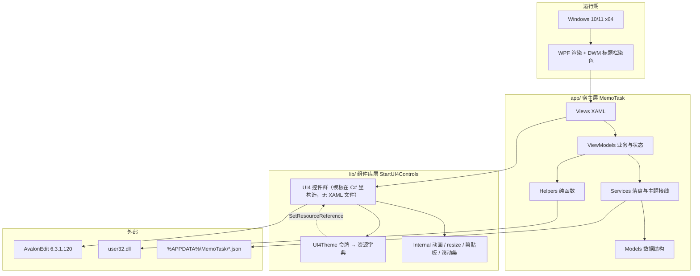

依赖方向单一：`Views → ViewModels → Services → Models`。`Models` 与 `Helpers` 不认识库类型，业务模型层零库污染；库引用只落在四个地方——`MainWindow` 与三个 `Views`（控件本体）、`MainViewModel`（订阅 `UI4Theme.ThemeChanged` 刷页脚）、`NotesViewModel/TodosViewModel`（`UI4MessageBox`、`UI4Clipboard`）、`SettingsViewModel`（`UI4Theme`、`UI4ColorPicker`、`UI4MessageBox`），外加 `ThemeService` 这一个受控出入口。

---

## 三、项目架构

### 3.1 三个页面 + 一个导航宿主

窗口结构只有一层分叉：`ui:UI4Grid` 里放一个 `DockPanel`，页脚是 `DockPanel.Dock="Bottom"` 的 `Border`，剩下的全部空间给 `UI4NavigationView`（左栏 96 px），它的每个导航项内容区挂一个 `UserControl`。

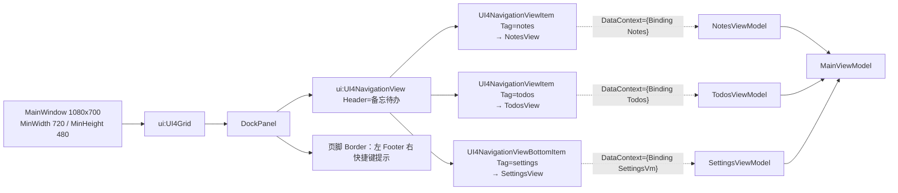

三个架构选择值得点名：

1. **导航项用 `Tag` 字符串而不是控件对象当页面标识**。`MainViewModel.CurrentPage` 只存 `notes/todos/settings`，业务层因此不需要认识 `UI4NavigationViewItem`（`MainViewModel` 类注释写了这条）。
2. **标题栏不自绘**。窗口里有 UI4 控件，库会在 `Loaded` 时按 DWM 把原生标题栏染色，自绘反而多一套色源（`MainWindow.xaml` 注释）。
3. **响应式分档由宿主算，不由 XAML 钉死**。`MainWindow.WideContentWidth = 760`：内容区宽（`ActualWidth - 96`）达标就列表与编辑器并排，不达标就一次只显示一栏（`UpdatePanes` → `NotesViewModel.IsWide`）。

页面 Key 的通路有个库侧限制：`UI4NavigationView` 的选中变化没有可直接绑定的事件契约，`MainWindow` 构造函数用 `DependencyPropertyDescriptor.FromName("SelectedItem", ...)` 挂 `AddValueChanged` 来观察，回调里把 `Tag` 交给 `MainViewModel.NotifyPageChanged`，同时写 `Settings.Current.LastPage`。两个闸门要注意：`_navReady` 在 `OnContentRendered` 之前为 false，所以初次布局期间的选中变化不会污染 `LastPage`；`NotifyPageChanged` 内部先 `FlushAll()` 再切页，避免上一份草稿跟着新页脚跑。窗口关闭时 `Closed` 里 `RemoveValueChanged` 退订。

### 3.2 启动顺序是承重的

顺序不能改，因为库内写回资源字典的第一句是 `Application.Current == null` 就返回——注册早了会静默不装字典，宿主所有 `{DynamicResource UI4.*}` 取空。

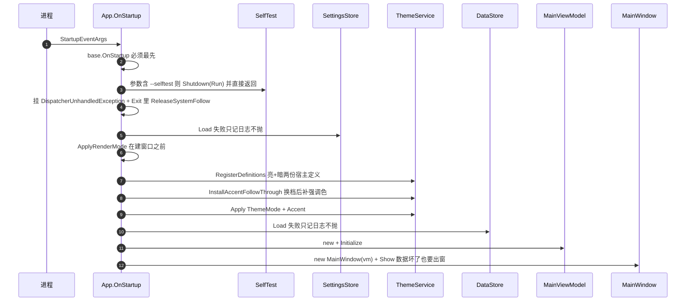

`--selftest` 分支排在异常钩子之前，所以自测不挂 UI 钩子、不开窗、不读用户设置（`SelfTest` 类注释）。断言 10（预置套装资源键齐全）依赖 `Application.Current`，这就是它必须排在 `base.OnStartup` 之后的另一个原因。

### 3.3 关窗与生命周期

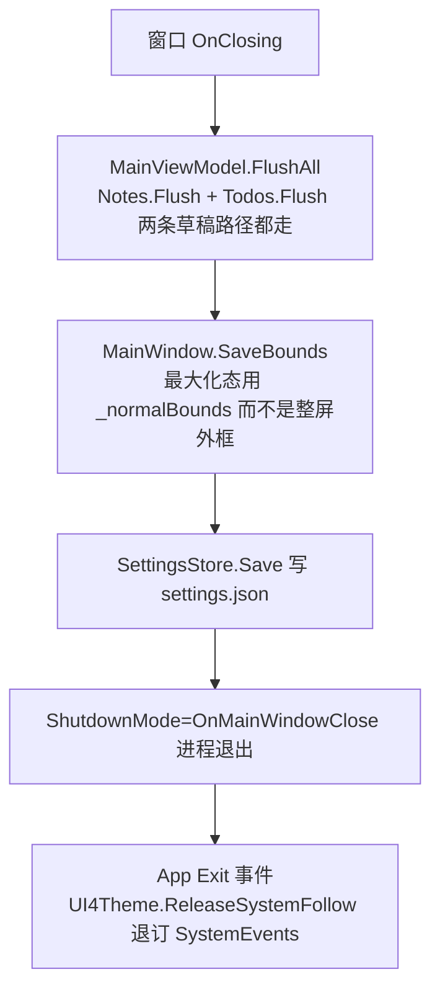

`FlushAll` 同时被 `Ctrl+S`、切页（`NotifyPageChanged`）和设置页导出备份调用——只有这三个出口会读草稿。

---

## 四、代码地图

### 4.1 工程根

```
示例项目2（备忘录）/
├─ app/                     宿主应用 MemoTask.csproj（所有业务代码）
├─ lib/                     StartUI4Controls v3.0.0 上游源码逐文件镜像（约定：不改）
├─ doc/运行与构建（T0Level）.md   构建 / 调试 / 打包 / 验收判据与逐条实测输出
├─ publish.cmd              自带运行时单文件包 + --selftest 门禁
├─ publish_no_runtime.cmd   框架依赖单文件包（目标机需装 WindowsDesktop 10.x）
├─ verify-window.ps1        起进程 → 轮询主窗口 → 回读标题 → 只关自己起的 pid
├─ scan-spacing.ps1         扫 Margin/Padding 是否都在 4 的倍数刻度上
├─ icon-check.ps1           取 exe 内嵌图标与 app/AppIcon.ico 逐像素比
└─ app/快速启动.txt          命令速查（构建、两档打包、自测、改图标、改配色）
```

### 4.2 app/ 逐个文件

| 文件 | 一句话职责 | 关键成员 |
|---|---|---|
| `MemoTask.csproj` | 版本守门 + 单文件发布开关 + 产物名后缀 | `<Version>0.1.0`、`PublishSingleFile` 条件组、`ArtifactLabel` |
| `app.manifest` | PerMonitorV2 DPI、supportedOS | — |
| `App.xaml` | **只放两个跨页共用转换器**，不放色值 | `BoolToVis`、`InvBoolToVis` |
| `App.xaml.cs` | 启动顺序、渲染档位、全局异常钩子 | `OnStartup`、`ApplyRenderMode`、`Report` |
| `MainWindow.xaml` | 导航骨架 + 页脚 + 快捷键提示文案 | `Nav`、`NavNotes/NavTodos/NavSettings` |
| `MainWindow.xaml.cs` | 窗口边界存取、响应式分档、快捷键路由 | `WideContentWidth`、`UpdatePanes`、`OnPreviewKeyDown`、`RestoreWindowBounds`、`SaveBounds`、`TrackNormalBounds` |
| `Models/NoteItem.cs` | 一条备忘（字段即落盘结构） | `Id/Title/Body/Tags/Pinned/CreatedAt/UpdatedAt/SafeTitle(JsonIgnore)` |
| `Models/TodoItem.cs` | 一条待办 + 优先级枚举 | `TodoPriority{Low,Normal,High}`、`DueDate(nullable)`、`IsOverdue` |
| `Models/AppSettings.cs` | 9 项用户配置 + 窗口边界 | `ThemeMode/Accent/StartPage/LastPage/AutoSaveMs/DefaultPriority/TodoFilter/NoteSort/RenderMode/Window` |
| `Services/AppPaths.cs` | 数据根目录 + 三个数据文件 + 备份目录 + 两个日志文件；`%APPDATA%` 不可写时回落程序目录 | `DataDir`、`NotesFile/TodosFile/SettingsFile/BackupDir/SelfTestReport/ErrorLog` |
| `Services/JsonStore.cs` | 原子写 + 脏数据留档 + 序列化选项 | `Load<T>`、`Save<T>`、`Quarantine`、`ToJson<T>` |
| `Services/DataStore.cs` | 备忘与待办的**内存真源**，无视图逻辑 | `Notes`、`Todos`、`Load/SaveNotes/SaveTodos/SaveAll`、`DataSizeBytes` |
| `Services/SettingsStore.cs` | 设置的持有者与读写 | `Current`、`Load/Save` |
| `Services/ThemeService.cs` | 主题唯一出入口，界面不许直接调 `UI4Theme` | `RegisterDefinitions`、`Apply`、`ApplyAccent`、`InstallAccentFollowThrough`、`ResolvedDescription`、`CurrentAccent` |
| `Services/AppInfo.cs` | 「关于」要的运行事实，全部现取不缓存 | `Version`、`ComponentVersion`、`Framework`、`RuntimeMode`、`UpTime` |
| `Services/BackupBundle.cs` | 导出快照结构（带 App/Version/ExportedAt 元数据） | `Notes`、`Todos` |
| `Services/SelfTest.cs` | 28 条断言，退出码 = 失败数 | `Run`、`SettingsRoundTrip`、`Contrast` |
| `ViewModels/MainViewModel.cs` | 三页宿主 + 页脚 | `Initialize`、`NotifyPageChanged`、`FlushAll`、`ReloadAll`、`UpdateFooter` |
| `ViewModels/NotesViewModel.cs` | 备忘录页全部状态（最大的一文件，628 行） | `Cards/TagOptions/SortOptions`、`SearchText/TagFilter/SortKey`、`Edit*`、`IsWide/ShowList/ShowDetail/ListColumnWidth`、`Reload/RefreshOrder/Flush` |
| `ViewModels/TodosViewModel.cs` | 待办页全部状态（586 行） | `Rows/FilterOptions/SortOptions/PriorityOptions`、`New*`、`Edit*`、计数组、`ToggleDone/RequestDelete/BeginEdit` |
| `ViewModels/SettingsViewModel.cs` | 设置页五组卡片（应用信息/外观/行为/数据/快捷键）+ 强调色 | `ThemeKey/StartPageKey/AutoSaveKey/DefaultPriorityKey/RenderModeKey`、`AccentSwatches`、`ExportBackup/ClearData/OpenDataFolder` |
| `ViewModels/NoteCardViewModel.cs` | 备忘卡片的展示投影（现算 + `Refresh` 广播） | `Preview/TagsLabel/MetaLine` |
| `ViewModels/TodoRowViewModel.cs` | 待办卡片投影 + 行内三个命令回调 owner | `PriorityKey/DueLabel/MetaLine`、`PriorityText` |
| `ViewModels/ViewModelBase.cs` | `SetProperty` / `RaisePropertyChanged` | — |
| `ViewModels/RelayCommand.cs` | `ICommand` 两个实现，挂 `RequerySuggested` | `RelayCommand`、`RelayCommand<T>` |
| `ViewModels/OptionItem.cs` | 下拉项：`Key` 落盘 / `Label` 展示 / **`ToString()` 必须返回 Label** | — |
| `Helpers/Theme.cs` | 宿主配色单源 + 一组纯函数（混色/亮度/前景/HEX 往返）+ **`Policy` 显式决策位** | `Policy`、`Accent`、`Danger/Warning/Success`、`Mix`、`IsDark`、`OnAccentFor`、`ToHex`、`TryParseHex` |
| `Helpers/TimeText.cs` | 相对时间文案 + 中文宽容日期解析 | `Relative`、`Due`、`TryParseDate`、`IsClearDateWord` |
| `Helpers/TagText.cs` | 标签 = 逗号分隔的一行字，多分隔符 + 去重 | `Split/Join/Contains` |
| `Helpers/Monitors.cs` | 多屏可见性判定与夹回 | `IsVisibleOnSomeMonitor`、`ClampToNearestMonitor` |
| `Converters/InverseBooleanToVisibilityConverter.cs` | `false/null → Collapsed` | — |
| `Views/NotesView.xaml(.cs)` | 备忘页布局；code-behind 只接手聚焦 | `SearchFocusRequested` → `Dispatcher.BeginInvoke` 聚焦 |
| `Views/TodosView.xaml(.cs)` | 待办页布局；code-behind 只处理输入框回车 | `OnAddKeyDown` |
| `Views/SettingsView.xaml(.cs)` | 设置页布局；code-behind 手搭强调色色板 | `BuildPalette`、`MarkSelected` |

### 4.3 谁依赖谁

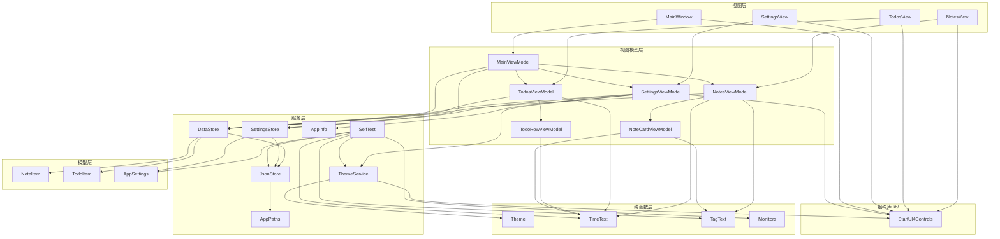

一条不成文规矩被写进了注释：**界面里要跟主题走的颜色一律写 `{DynamicResource UI4.Brush.*}`，不许引用 `Helpers/Theme.cs` 的常量**（`Theme` 类注释）。`Theme.cs` 的常量只喂给两处——`ThemeService` 铺令牌，以及状态色 `{x:Static h:Theme.Danger}`（有意不跟主题，逾期就该是红的）。

---

## 五、组件架构

### 5.1 lib/ 这一层是什么形态

37 个 `UI4*.cs` + 6 个 `Internal/*.cs`，**库里 0 个 XAML 文件**：控件的可视树在构造函数里用 `ControlTemplate` + `FrameworkElementFactory` 建，滚动条样式是 `Internal/ScrollBarResources.cs` 用 `XamlReader.Parse` 解析字符串生成。主题接线靠 `SetResourceReference`（本机 grep：110 处、27 个文件），不是控件自己在 `ThemeChanged` 里重设属性——3.0.0 之后 `ThemeChanged` 只剩 `UI4WindowTitleBar`（DWM 染色）和 AvalonEdit 高亮两个消费者。

`Internal/` 六个文件里，本应用间接用到的是：`ScrollBarResources`（滚动条样式，进 `UI4ScrollViewer`/`UI4ComboBox`/`UI4TextBox`/`UI4ListView`）、`ColorToBrushConverter`（多个控件内部把 Color 属性转笔刷）、`WindowAnimationHelper` + `WindowResizeBehavior`（`UI4MessageBox` 与 `UI4ColorPicker` 这两个 Window 的入场动画和 8 向 resize 边框）、`ClipboardCommandTakeover`（让 `UI4TextBox` 的复制粘贴绕开 WPF 的 OLE 通路走 `UI4Clipboard`）。`ThemeSync.cs` 是 2.0.0 遗留死代码，全库 0 引用（审计报告 A2-7 已点名，本项目不改）。

### 5.2 主题令牌通路（本应用的主干管线）

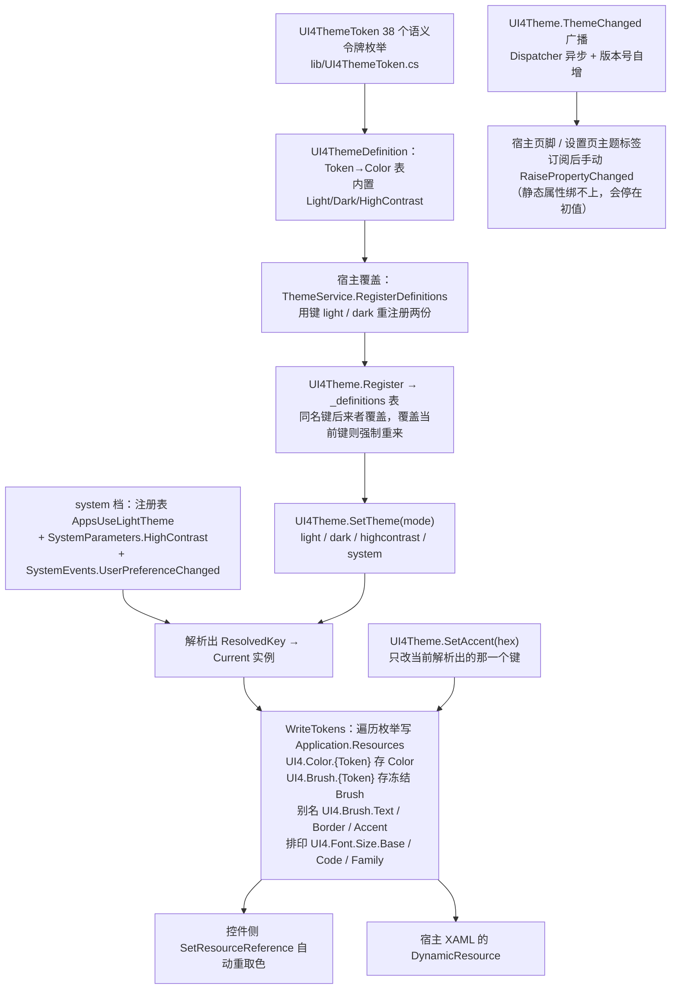

三个必须知道的性质：

1. **强调色是写进「当前键的定义」里的**，所以换档后另一档还是原色 → `ThemeService.InstallAccentFollowThrough` 在 `ThemeChanged` 里补一次 `SetAccent`，并用 `_suppressAccentReapply` 掐掉回调递归（`ThemeService` 类注释两条硬约束）。
2. **恢复默认强调色不靠"切走再切回"**：重新注册一份同键定义 = 库里就地整体重来，见 `ResetAccentToDefinition`。
3. **本应用有意不发放 `UI4ThemePacks` 的 8 套业务主题**，也不用 `UI4ThemeScope` 局部换肤（`App.OnStartup` 里那句"本次不分发 UI4ThemePacks 的 8 套业务主题"注释 + T0Level 文档第三挡决策）。所以 `SelfTest` 第 10 条断言跑的套装键齐全性是"给未来的改动兜底"，不是当前功能。

### 5.3 本应用用到的控件契约

| 控件 | 用在哪 | 关键属性/方法 |
|---|---|---|
| `UI4Grid` / `UI4Panel` | 窗口根 / 卡片容器 | `CornerRadius`、`ShadowDepth/BlurRadius/Opacity`、`ContentPadding`、`HoverScale` |
| `UI4NavigationView` + `Item` + `BottomItem` | 左栏导航 | `Header`、`LeftPanelWidth`、`SelectedItem`、`Item*` 系列；项上 `Tag/Header/TextIcon/TextIconFontFamily` |
| `UI4ListView` | 两个卡片列表 | `ItemsSource`、`SelectedItem`（配 `IsSynchronizedWithCurrentItem="False"`）、`ItemMargin/CornerRadius`、投影组、`HoverScale` |
| `UI4TextBox` | 搜索、标题、正文、标签、快速添加、日期框 | `Text`（一律 `UpdateSourceTrigger=PropertyChanged`）、`PlaceholderText`、`InnerPadding`、`AcceptsReturn`、`ShowClearButton` |
| `UI4ComboBox` | 11 处筛选/配置下拉（备忘 2、待办 4、设置 5） | `ItemsSource` + `DisplayMemberPath=Label` + `SelectedValuePath=Key` + `SelectedValue` 双向绑 Key |
| `UI4Button` | 所有动作 | `Command`、`GradientStart/End`（危险动作上 `Theme.Danger`） |
| `UI4CheckBox` | 待办勾选 | `IsChecked` 走 **OneWay + Command**，不让控件自己改视图模型 |
| `UI4Switch` | 置顶开关 | `IsOn` 双向绑 `EditPinned` |
| `UI4ProgressBar` | 待办完成度 | `Value={Binding Percent}`、`Maximum=100` |
| `UI4ScrollViewer` | 设置页 | `VerticalScrollBarVisibility` |
| `UI4MessageBox` | 三处删除/清空确认 | 静态 `Show(content, title, buttons, width, owner)` → `bool?`：OK=`true`、Cancel=`false`、右上角关闭=`null`（宿主一律 `== true` 才执行） |
| `UI4ColorPicker` | 自定义强调色 | 静态 `ShowDialog(title, defaultColor, owner)` → `Color?` |
| `UI4Clipboard` | 复制正文 | `TrySetTextAsync(text, Action<bool> onDone)`，后台最多 30×100 ms 重试，回调投回原线程；**非 Task、无返回值** |

### 5.4 宿主侧对上游的补偿（4 条 + 1 条配套）

这几处不是风格偏好，是撞出来的。改动同类代码前先读，否则会重复踩。

| 库的缺口 | 宿主的写法 | 位置 |
|---|---|---|
| `UI4NavigationViewItem.ItemFontSize` 这个 DP 的 `OwnerType` 登记在 `UI4NavigationView` 上，XAML 侧挂不上，默认 10 px 低于可读下限 | 后台用 `Nav.SetValue(UI4NavigationViewItem.ItemFontSizeProperty, 12.0)` | `MainWindow` 构造函数 |
| `UI4NavigationView` 的 5 个 `Item*` 属性字面默认值没接令牌，深色下黑字压黑底 | XAML 里显式接 `{DynamicResource UI4.Color.*}` / `UI4.Brush.Text` | `MainWindow.xaml` |
| `UI4ComboBox` 闭合态不走 `DisplayMemberPath`（实测显示成类型名截断），兜底只剩 `ToString()` | `OptionItem.ToString()` 返回 `Label` | `OptionItem` 注释 |
| `UI4Button` 构造里给 `GradientStart/End` 挂了 `SetResourceReference`，DataTemplate 内宿主赋的本地值会在容器实例化时被资源引用顶回主题色 | 强调色色板改由 code-behind 创建控件（不走那条时序），只有描边保留资源引用 | `SettingsView.xaml.cs.BuildPalette` + XAML 注释 |
| （配套）重建下拉数据源时 `ComboBox` 会先摘掉选中并把 `null` 写回绑定 | `TagFilter` / `FilterKey` 的 setter **忽略 null**，真实选项 Key 恒非 null | `NotesViewModel.TagFilter`、`TodosViewModel.FilterKey` |

### 5.5 `lib/` 是上游镜像，不是本项目的代码

`lib/README.md` 与 `lib/架构审计报告-3.0.0主题机制评审.md` 随源码一起放在库里。构建时固定的 **9 条警告**（`CS0414`×5、`CS1574`×4）全部来自 `lib/`，**不要去"修"**——修完就和上游脱钩。少文件时 `dotnet pack` 会报 `NU5019` 并把整条构建链拖红，恢复办法见 T0Level 文档第 7 节。

---

## 六、数据流图

### 6.1 全链路

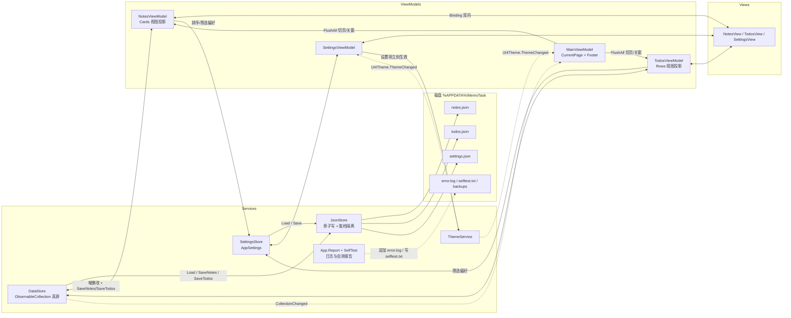

### 6.2 一次备忘编辑的流（草稿模式）

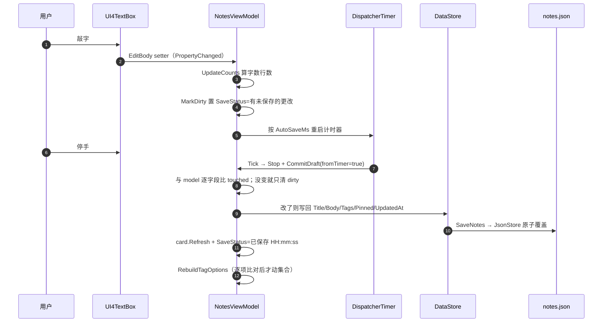

四条落盘出口：`自动保存计时到点` / `切换选中项`（`SetSelection`） / `Ctrl+S`（`SaveNowCommand`） / `关窗或切页`（`Flush`）。**打字期间不重排列表**——重排只在 `Rebuild` 里做，而 `Rebuild` 不由 `MarkDirty` 触发。

### 6.3 一次待办勾选的流（即时模式）

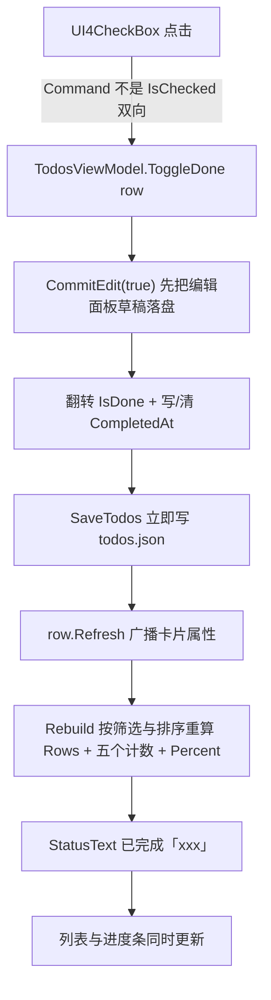

**待办即时落盘、备忘草稿落盘**是两页最大的口径差。理由写在各文件头注释里：勾选这类动作期望"点了就在"，长文编辑期望"别在我打字时动文件"。

### 6.4 视图投影的缓存策略

`DataStore` 的原始集合 → 页面各自维护一份**筛选+排序后的投影**（`Cards` / `Rows`），投影元素是卡片级视图模型，按 `Id` 缓存在字典里：

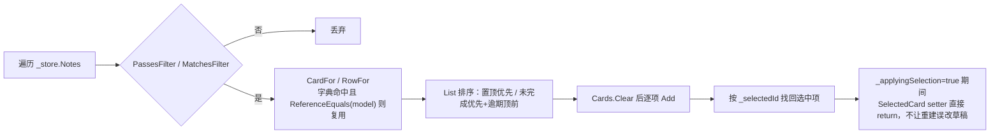

缓存的存在是为了让 `SelectedItem` 的引用在重建后仍然稳定（`_applyingSelection` 标志 + `_selectedId` 找回这两件事共同保证：筛掉当前选中项时才会真的丢选中）。

---

## 七、工作流程

### 7.1 用户主流程

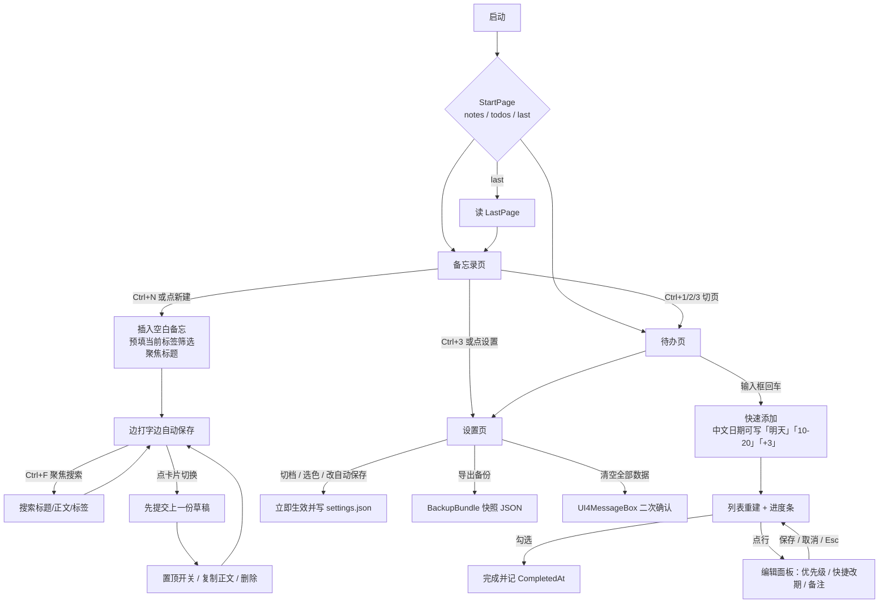

### 7.2 开发流程

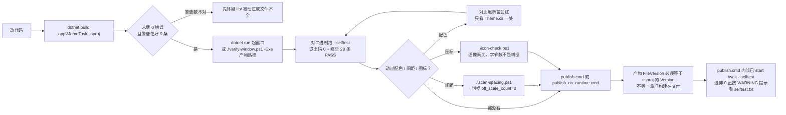

操作细节与本机实测数值（构建耗时、出窗毫秒、9 条警告的构成、28 条断言全文）都在 T0Level 文档，不在这里抄第二遍。

### 7.3 状态口径：三处"状态行"互不打架

| 状态行 | 归属 | 说的是什么 |
|---|---|---|
| `NotesViewModel.SaveStatus` | 备忘页编辑器上方右对齐 | **这份草稿**的落盘情况（有未保存的更改 / 已保存 HH:mm:ss / 没有需要保存的改动 / 剪贴板结果） |
| `TodosViewModel.StatusText` | 待办页筛选行左侧 | **这一条动作**的结果（已添加 / 已完成 / 日期没看懂 / 标题不能为空） |
| `MainViewModel.Footer` | 窗口底部 | 全局事实快照（当前页 · 备忘数 · 待办数 · 主题解析结果） |

设计口径：单页的动作反馈留在页内，跨页的事实才进页脚。页脚的条数订阅集合 `CollectionChanged`（只随增删变），主题那半句订阅 `UI4Theme.ThemeChanged`（静态属性绑不住）。

---

## 八、工作原理

### 8.1 主题：一条链 + 一个补色回调

`SettingsViewModel.ThemeKey` 是唯一的切档入口，链路只有一条：

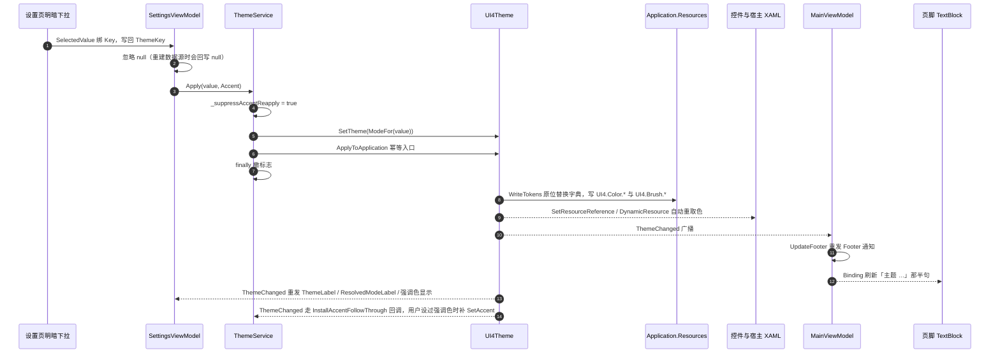

四个"为什么"：

- **为什么界面不许直接调 `UI4Theme`**：多处 `SetTheme` 会打架，真源必须是设置项。见 `ThemeService` 类注释。
- **为什么强调色要用 `Func<string>` 现取而不是启动时快照**：用户中途改色不该要求重启（`InstallAccentFollowThrough` 注释）。
- **为什么页脚不直接绑 `UI4Theme.ResolvedKey`**：WPF 绑静态 CLR 属性找的是同名 `<Prop>Changed` 事件，库发的是 `StaticPropertyChanged`，绑上去会停在初值。所以一律"订阅 + 手动重发通知"（`SettingsViewModel` 构造函数注释）。
- **为什么状态色不跟主题**：38 个令牌里没有"危险/警示"语义位，逾期就该是红的，换肤不该改变含义；因此它们是有意固定色相，且对比度在两档底色上都有断言守着（`Theme.Danger` 注释 + `SelfTest` 第 4 组）。

### 8.2 落盘：四条触发 + 一次原子替换

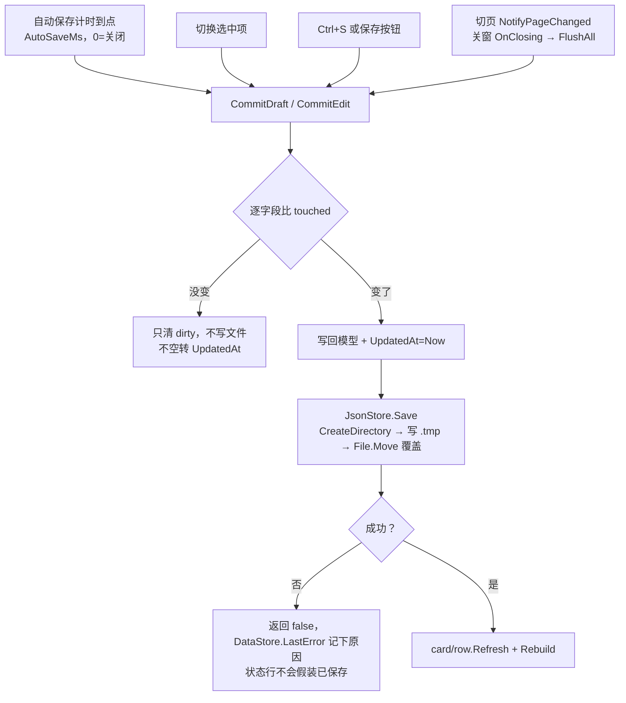

### 8.3 中文输入宽容解析

待办的截止日输入框是唯一"用户自由手打"的地方，解析优先级写死在 `TimeText.TryParseDate`：

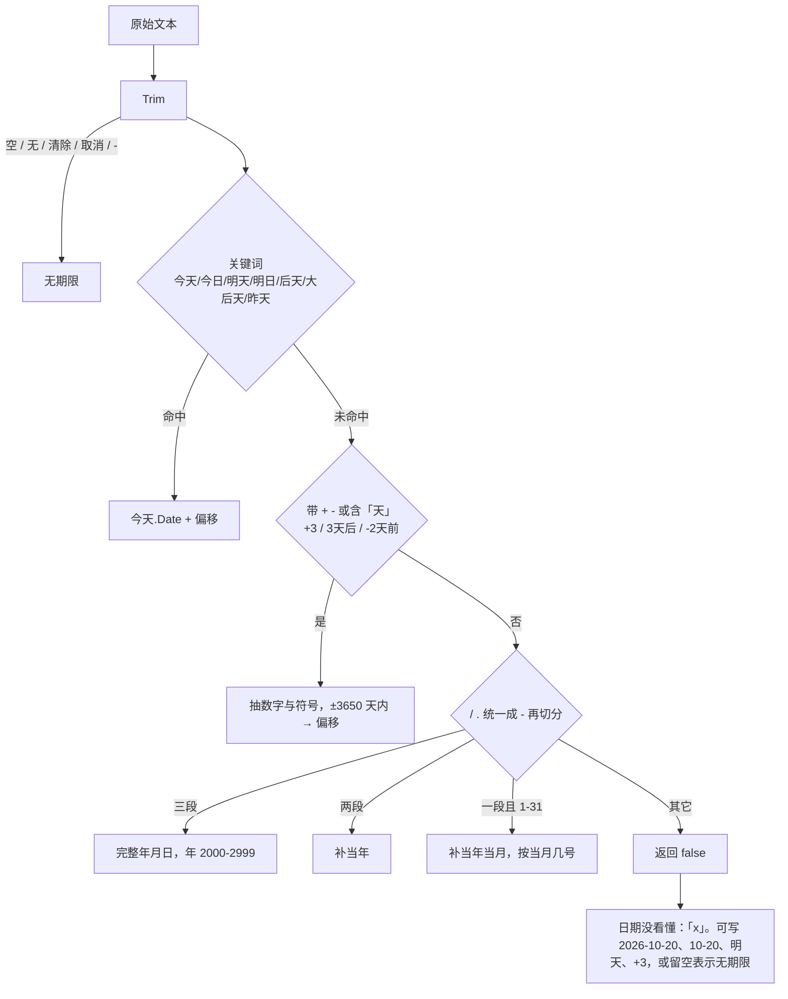

裸数字**必须**带 `+/-` 或"天"才当相对天数，否则当"当月几号"——这条歧义规则由 `SelfTest` 第 8 组的三行断言钉住（`+3` / `3天后` / `-2天前` 对 `2026-2-30` / `13-45` / `下辈子`）。

### 8.4 窗口状态的两条自适应

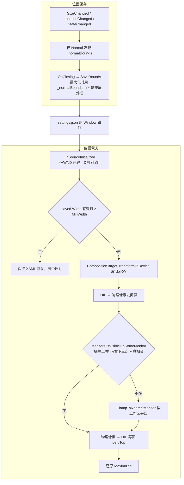

- 最大化时 `Left/Top/Width/Height` 报的是整屏外框，直接存会导致还原后尺寸越界，所以用 `_normalBounds` 缓存还原态（`TrackNormalBounds` 注释）。
- 显示器坐标是物理像素、WPF 是 DIP，**换算必须在同一单位里比**，否则 125% 缩放机器上会误判"窗口已丢失"。

### 8.5 渲染档位与白屏兜底

`RenderOptions.ProcessRenderMode` 是进程级开关，只在建窗口前有效——所以设置页明确写"重启应用后生效"，不假装立刻生效（`SettingsViewModel.RenderModeKey` 注释）。默认 `auto` 走硬件加速；`software` 是给"标题栏在、客户区整片白"这类合成/截屏故障留的手动降级档。

### 8.6 自测与发布门禁

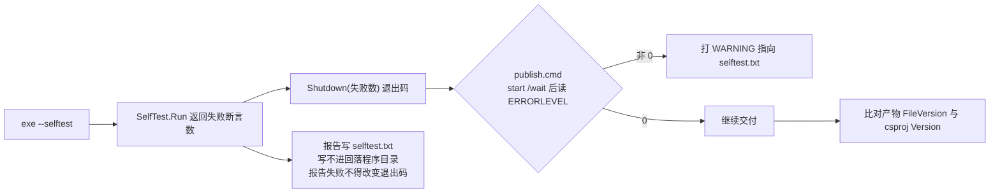

28 条断言按面分组（详单见 T0Level 第 2 节）：令牌总数 = 38；三份内置定义逐令牌可取色；宿主配色对比度门槛（正文/底 ≥4.5、强调/白 ≥3.0、状态色两档 ≥3.0）；`Mix`/`IsDark` 边界；HEX 往返与脏输入拒绝；**明暗策略必须显式决策**（`Theme.Policy` 留在 `"TODO"` 就红，防止工程带着"没定"上路）；中文日期与标签解析；多屏坐标判定；8 套预置 × 38 令牌资源键齐全；宿主 XAML 实际用到的 12 个键齐全；字典底色与 `Dark()` 定义同源；设置整份往返（含未落位的 `NaN` 坐标）。

注意一个判据陷阱：**旧产物也是退 0，只是少几条断言**。判断"是不是本轮产物"要用 SHA256 或 `LastWriteTime`，别用字节数（`app/快速启动.txt`）。

### 8.7 间距与交互反馈口径

- **间距只用 4 的倍数**：分组之间 16，同排兄弟 12，内容到窗口边缘 20，卡片外边距 24 ≥ `ShadowDepth(12) + ShadowBlurRadius(12)`，投影四边不被切。机器可查：`scan-spacing.ps1`。
- **悬浮一律走描边色，不走放大**（2026-10-04 定），所以列表和卡片上都能看到 `HoverScale="1"`。
- 控件字号在宿主侧定档（11/12/13/15/16/17/18），颜色要跟主题走的写 `{DynamicResource UI4.Brush.*}`，不跟的写 `{x:Static h:Theme.*}`。本地赋值即退订主题，属预期行为，不是缺陷。

---

## 附：交叉引用

| 想知道 | 去哪份文档 |
|---|---|
| 怎么构建、跑起来、两档打包、本机实测数值 | `doc/运行与构建（T0Level）.md` §1–§3 |
| 改标题 / 换图标 / 分发的具体步骤 | 同上 §4–§6 |
| 九个警告的构成、验证陷阱、交付目录清单、未验证项 | 同上 §7 |
| 命令速查 | `app/快速启动.txt` |
| 某个 UI4 控件的全部属性与用法配方 | `lib/README.md` §二（清单）、§三（详解）、§四（主题系统）、§六（配方） |
| 3.0.0 主题机制的评审结论与已知缺陷 | `lib/架构审计报告-3.0.0主题机制评审.md` |

**一处已知不一致**：`doc/运行与构建（T0Level）.md` 开头「工程根」那行记的是搬移前的绝对路径（`…\WPF桌面APP开发\aaa`），与当前目录名不符；那份文档里的**相对**路径与命令仍然可用。本文一律用相对路径书写，不再抄绝对路径，免得第二处也漂。
