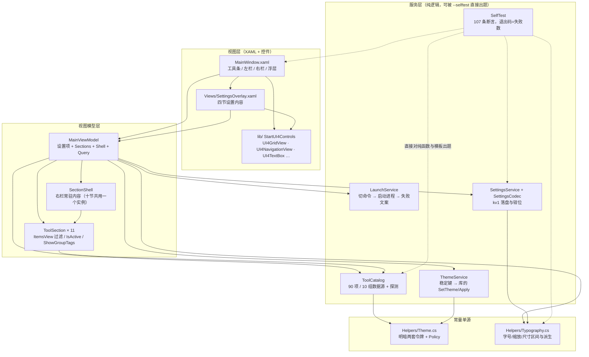
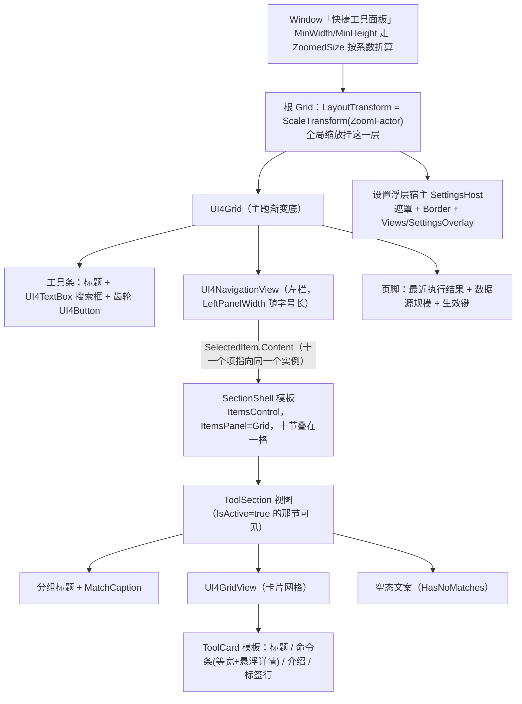
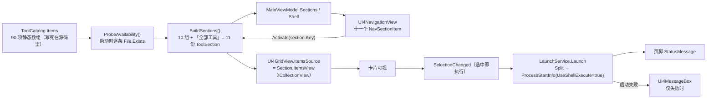
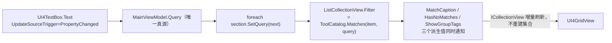
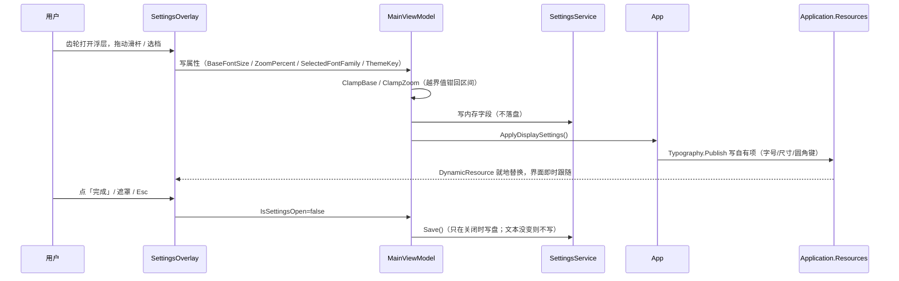
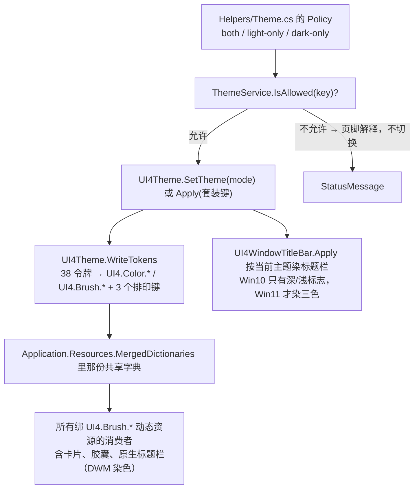
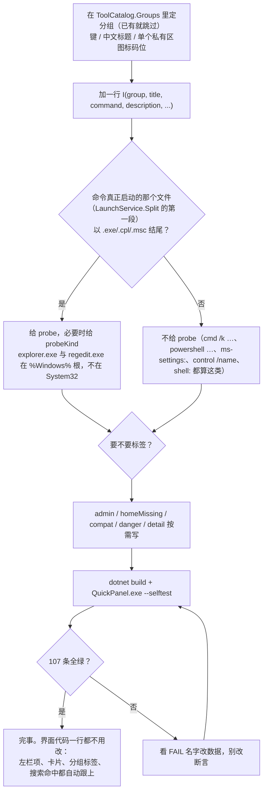
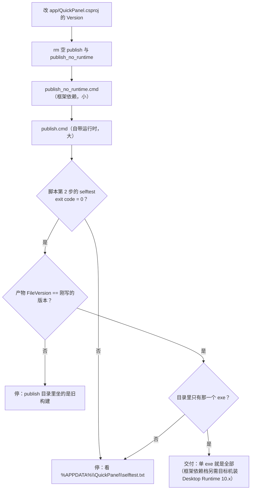
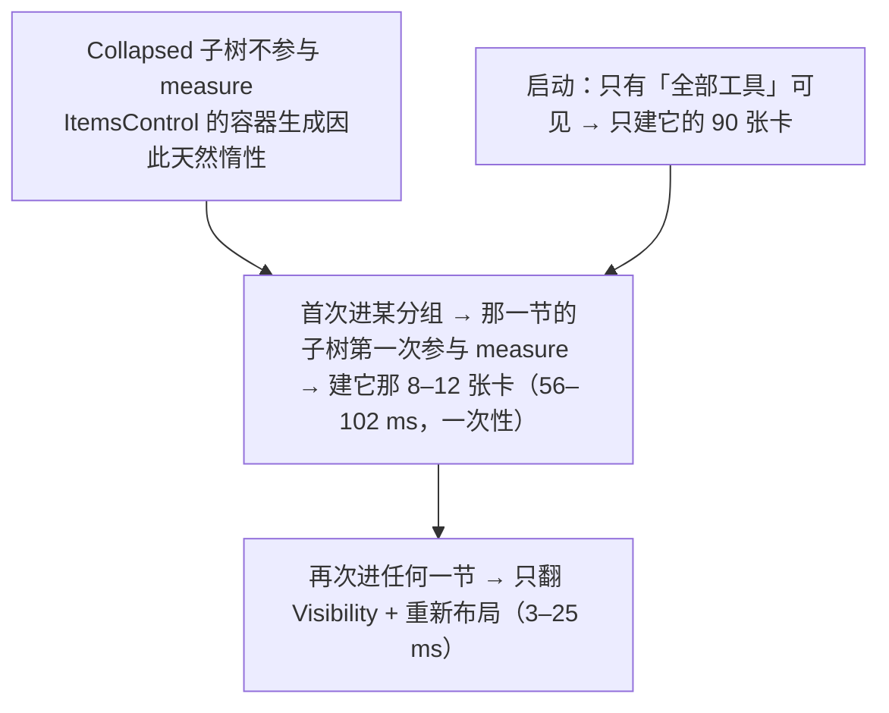
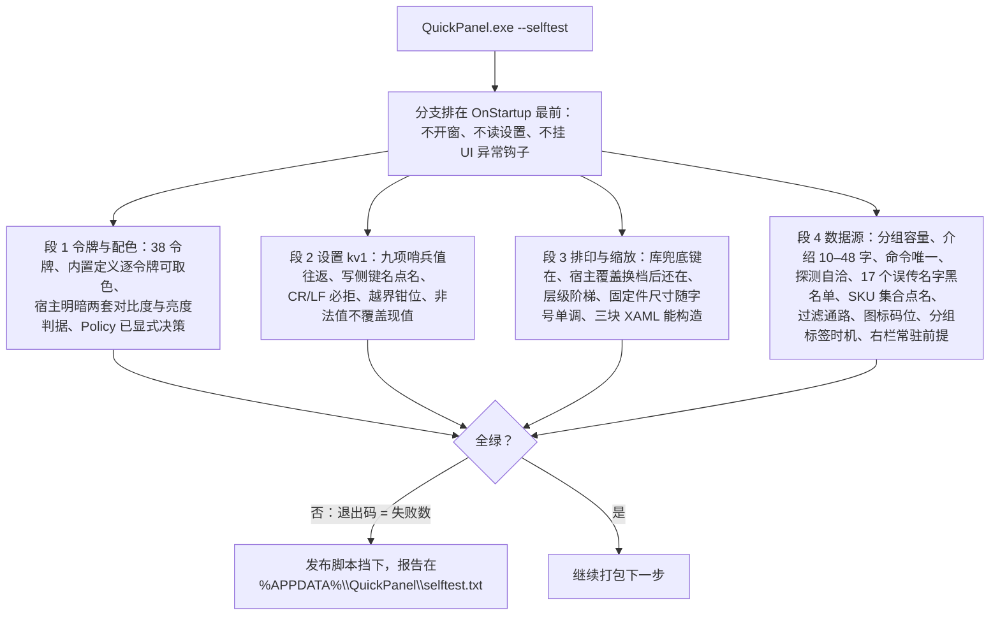

# QuickPanel 项目全景

> 这份文档回答的是"**这个项目长什么样、为什么这么搭、东西在哪、怎么流起来**"。
> 怎么把它跑起来、怎么打包发版、每条命令的判据是什么，在 **[`doc/运行与构建（T0Level）.md`](doc/运行与构建（T0Level）.md)**；组件库自身的 API 手册在 **[`lib/README.md`](lib/README.md)**（那是 vendored 的上游文件，不要改）。
> 文中所有数字都是 2026-10-04 本轮在本机（Win11 26300 / .NET SDK 10.0.401）实测或机器校验过的值，改代码后请连带核对第 10 节的数字速查。

---

## 1. 创建目的与解决的问题

### 1.1 要解决的问题

Windows 自带的系统入口（控制面板项、管理控制台、设置页、命令行诊断工具）**知道在哪的人觉得简单，不知道的人一辈子找不到**：

- 入口散在四处：控制面板 / `Win+R` 运行框 / 开始菜单设置里翻三级页 / `System32` 下的 `.msc`；
- 名字不透明：普通用户不会把"想看机器上哪些端口开着"和 `netstat -ano` 对上；
- 社区命令表**质量差**：里面大量名字（`input.cpl`、`access.cpl`、`wmic.exe`、`fstrim.msc`…）在现代 Windows 上根本不存在，抄来的表要么点了报错，要么把"家庭版没有这个组件"和"要管理员权限"混成一句"启动失败"，用户只能瞎试。

### 1.2 这个项目的回答

一块**左侧按功能分组、右侧卡片式**的面板：一张卡 = 一个系统入口，卡上同时给出**中文功能名、命令原文、一句写给普通人的介绍、以及兼容性标签**；单击即执行。三条硬口径：

| 口径 | 落地方式 |
|---|---|
| 只收 Win10 与 Win11 都能解析的入口 | 每条命令本机逐条实测；行为不一致的写进卡片标签而不是删掉（11 项有兼容备注） |
| SKU 差异与权限差异是两件事 | `HomeEditionMissing`（7 项，家庭版根本没这个文件）与 `RequiresAdmin`（37 项）分列，失败文案也分开说 |
| 流传但实测不存在的名字不收 | 17 个误传名字进黑名单，由 `--selftest` 点名挡住，防止以后被"照社区表补回来" |

### 1.3 不做什么（边界）

- **不是**通用启动器 / 快捷方式管理器：只收系统自带入口，不收第三方程序与用户自建项。
- **不是**系统优化器：所有卡片都只是"把某个系统工具打开"，项目自己不写注册表、不改任何系统状态（唯一的例外是「重建图标缓存」那条，它会停一次 Explorer，卡片上打了危险标签）。
- **不做**执行确认：按"单击直接执行"的决策推进，危险项靠卡片文案提醒（`danger` 胶囊），不弹确认框。
- **不接**套装键与局部换肤：只用内置明暗两档 + 宿主自己的两套定义，不用 `UI4ThemePacks` 的 8 套业务档，也不用 `UI4ThemeScope`。

---

## 2. 项目技术栈

| 层 | 选型 | 版本 / 口径 | 为什么是它 |
|---|---|---|---|
| 运行时 | .NET | `net10.0-windows` | WPF 只在 Windows 桌面运行时上有；`app.manifest` 声明 `PerMonitorV2`（net10 的 WPF 仍按清单取 DPI 级别） |
| UI 框架 | WPF | `UseWPF=true` | 纯桌面、要原生标题栏染色与托盘这类系统集成面 |
| 组件库 | `StartUI4Controls` | **3.0.0**（`lib/StartUI4Controls.csproj`） | **零 XAML** 组件库：控件模板全由 C# 构建，主题是一张 38 令牌表（令牌数由自测钉住）。工程内是 **44 个 `.cs`**（`lib/` 38 + `lib/Internal/` 6），控件清单见 `lib/README.md`。以**整份源码工程引用**（`ProjectReference ../lib/`）而不是 dll / NuGet，交付包能独立 clone 重建 |
| 编辑器内核 | `AvalonEdit` | 6.3.1.120（lib 唯一第三方依赖） | 只被 `UI4CodeEditor` 用；本项目当前没用到该控件，但 restore 必须能拿到它 |
| MVVM | 手写，不引框架 | `ViewModelBase` + `RelayCommand`（各 23 / 56 行） | 只有 INotifyPropertyChanged 与 ICommand 两件事要解决，引 CommunityToolkit 不划算 |
| 语言约定 | C# latest | **`Nullable=disable`、`ImplicitUsings=disable`** | 全项目显式 `using`、不用可空引用类型注解；新增文件必须照此，否则会出现"只有我的文件带隐式 using"的分裂风格 |
| 设置存储 | 自研 kv1 纯文本 | `%APPDATA%\QuickPanel\settings.json`，9 个键 | 无 schema、可手改、坏文件改名留档、读回一律钳位；引 JSON 库反而多一个依赖 |
| 图标 | 本地生成的像素点阵 | `app/AppIcon.ico`（7 帧 32bpp ICO） | 由 Skill 的 `make-icon.ps1` 生成，不联网、不依赖 ImageMagick |
| 质量门禁 | 自测内建在 exe 里 | `QuickPanel.exe --selftest`，**107 条断言**，退出码 = 失败数 | 发布脚本拿它当闸门；见第 8.7 节 |
| 图标字体 | Segoe MDL2 Assets | 不用 Segoe Fluent Icons | Fluent 是 Win11 独有，Win10 上渲染成豆腐块 |

---

## 3. 项目架构

### 3.1 目录树（交付状态，78 个文件：75 份源码/文档 + 2 个产物 exe + 本文）

```text
QuickPanel/
├── README.md                     本文：项目全景
├── doc/
│   └── 运行与构建（T0Level）.md   零基础上手：八节、每条命令带判据与本机真实输出
├── app/                          应用本体（MVVM 五层 + 启动）
│   ├── App.xaml / App.xaml.cs            启动序列（顺序承重）+ --selftest 分支 + 全局异常落盘
│   ├── MainWindow.xaml / .xaml.cs        工具条 / 左栏 / 右栏常驻容器 / 卡片模板 / 设置浮层宿主
│   ├── QuickPanel.csproj                 版本、图标、单文件发布开关、ArtifactLabel 分档
│   ├── app.manifest                      PerMonitorV2
│   ├── AppIcon.ico
│   ├── 快速启动.txt                       四条命令 + "加/改一个快捷入口"的最常做改动指引
│   ├── Models/          ToolItem.cs（一张卡的全部数据与标签文案）
│   ├── ViewModels/      MainViewModel.cs · ToolSection.cs（含 SectionShell）· ViewModelBase.cs · RelayCommand.cs
│   ├── Services/        ToolCatalog.cs（数据源）· LaunchService.cs · SettingsService.cs + SettingsCodec.cs
│   │                    ThemeService.cs · SelfTest.cs
│   ├── Helpers/         Theme.cs（宿主配色单源 + Policy）· Typography.cs（字号/缩放/尺寸单源）
│   ├── Converters/      Converters.cs（BoolToVis · ZoomedSize）
│   └── Views/           SettingsOverlay.xaml(.cs)
├── lib/                          组件库整份源码拷贝（44 个 .cs + csproj + LICENSE.txt + README.md + 架构审计报告）
│   └── Internal/         6 个内部件（ColorToBrushConverter 等）
├── publish.cmd                   单文件 + 自带运行时
├── publish_no_runtime.cmd        单文件 + 框架依赖
├── publish/                      产物（只一个 exe）
└── publish_no_runtime/           产物（只一个 exe）
```

不该进版本控制的：`app/bin`、`app/obj`、`lib/bin`、`lib/obj`、两个 `publish*` 目录、`%APPDATA%\QuickPanel\`。

### 3.2 分层与依赖方向



依赖只往下走：`Models` 不引用 `Services`（卡片上"所属大类"那枚标签的文案，是建项时由 `ToolCatalog` 现算好塞进 `ToolItem.GroupTitle`，而不是绑定时反查）。`Services` 与 `Helpers` 里没有 WPF 之外的界面依赖，`SelfTest` 因此能绕开窗口直接验逻辑。

---

## 4. 代码地图（要改哪儿，看这张表）

| 文件 | 职责 | 关键成员 | 改它之前先看 |
|---|---|---|---|
| `app/Services/ToolCatalog.cs` | **数据源**：90 项 / 10 组，一行一张卡 | `Groups`（键/标题/图标）、`GroupTitleOf`、`Items`、`I(...)` 建项器、`Matches`、`ProbePath`、`ProbeAvailability`、`BuildSections` | §7.1 新增入口流程、§8.5 探测口径 |
| `app/Models/ToolItem.cs` | 一张卡的数据与**标签文案** | `GroupTitle`、`CompatNote/DangerNote/DetailNote`、`PlatformChip/AdminChip/EditionChip/MissingChip/DetailTip` | §8.4 标签体系 |
| `app/ViewModels/ToolSection.cs` | 一个分组在右栏的那块内容 + 常驻外壳 | `ItemsView`（`ListCollectionView` 过滤）、`SetQuery`、`MatchCaption`、`HasNoMatches`、`IsActive`、`ShowGroupTags`；`SectionShell.Activate` | §8.1 右栏常驻 |
| `app/ViewModels/MainViewModel.cs` | 窗口可绑定视图：设置项 + 数据源 + 执行 | `Sections`/`Shell`、`Query`、`Execute`、`ThemeKey`、`BaseFontSize`、`ZoomPercent`、`IsSettingsOpen`、应用信息只读项 | §8.6 设置流 |
| `app/Services/LaunchService.cs` | 命令 → 进程 | `Split`（**按第一个空格切** file/args）、`Launch`、`BuildFailureText`（SKU/缺文件/提权分开说） | §8.5 |
| `app/Services/SettingsService.cs` + `SettingsCodec.cs` | kv1 落盘（`%APPDATA%\QuickPanel\settings.json`，9 键） | `ToMap`/`ApplyMap`（**加设置键必须同时改这两处 + 自测键名点名清单**）、`Load`/`Save` 永不抛 | §8.6 |
| `app/Services/ThemeService.cs` | 配色档的稳定键通路 | `AvailableKeys`、`IsAllowed`（被 `Theme.Policy` 挡）、`Apply`、`DisplayLabel`、`ResolvedKey` | §8.3 |
| `app/Helpers/Theme.cs` | 宿主配色单源 + **明暗策略** | `Policy`（`both`/`light-only`/`dark-only`，留 `TODO` 时自测直接红）、`BuildLightDefinition`/`BuildDarkDefinition` | §8.2 |
| `app/Helpers/Typography.cs` | 字号/字体/缩放与固定件尺寸的**唯一常量出处** | 默认值与区间、`SizeOf(role,base)` 层级换算、`NavRailWidth`/`SearchBoxWidth`、`Publish`（写资源键）、`BuildFamilyChoices` | §8.2 |
| `app/MainWindow.xaml` | 结构 + 模板 | `Window.Resources` 里三块模板（`ToolCard` / `SectionShell` / `ToolSection`）、`Chip*` 样式、齿轮入口、浮层宿主、根 `LayoutTransform` | §5 |
| `app/MainWindow.xaml.cs` | 只有胶水 | `BuildNavigation`（十一个项共用一个 Content）、`ActivateSelectedSection`、`ToolGrid_SelectionChanged`（执行后清选择）、几何持久化与越界回正、`NavSectionItem` | §8.1 |
| `app/App.xaml.cs` | **启动顺序**（承重） | `--selftest` 分支在最前 → `Register` 明暗两套 → `ThemeService.Apply` → `ApplyDisplaySettings` → 建窗 | §8.2 |
| `app/Services/SelfTest.cs` | 门禁 | 四段：令牌/配色、设置 kv1、排印与缩放、数据源；共 107 条 | §8.7 |
| `app/Converters/Converters.cs` | 两个转换器 | `BoolToVis`（浮层与标签显隐）、`ZoomedSize`（缩放下窗口下限折算） | §8.2 |

---

## 5. 组件架构

### 5.1 窗口可视结构



### 5.2 用到的库控件与宿主扩展

| 库控件 | 用在哪 | 宿主必须知道的点 |
|---|---|---|
| `UI4GridView` | 每个分组右栏 | `ItemWidth` 只是**算列数的基准单元**，卡片铺满所在列；`ItemHeight=NaN` 让卡片按内容长高；`ItemMargin=20` 同时是投影外溢余量（`ShadowDepth 8 + Blur 12 ≈ 20`）与悬浮放大余量（左右 ≥ 10）；`IsSynchronizedWithCurrentItem="False"` **必须显式关**，否则一改过滤就替你点第一张卡；`ItemsPanel` 是 `UniformGrid`，**不虚拟化** |
| `UI4NavigationView` | 左栏 | 项必须是 `UI4NavigationViewItem` 真身进 `Items`（库按类型分流）；右栏绑 `SelectedItem.Content`；它**不发 `SelectionChanged`**（`SelectedItem` 只是 `BindsTwoWayByDefault` 的 DP），宿主用 `DependencyPropertyDescriptor` 挂回调；六个颜色 DP 在库里是字面值，深色档下要逐个显式接回令牌 |
| `UI4TextBox` | 搜索框 | `ShowClearButton`；宽度走 `App.Size.SearchBox` 随字号长 |
| `UI4Button` | 齿轮、设置面板里所有按钮 | 钉死尺寸时必须显式给 `Padding="0"`（库默认 `10,0,10,0` 会把内容区挤成 8 px）；尺寸/圆角走 `App.Size.RoundButton` / `App.Radius.RoundButton` |
| `UI4MessageBox` | **只在执行失败时** | 返回 `bool?`，判 `== true`；模态框不用于成功提示 |
| `UI4Theme` / `UI4ThemeToken` | 主题接线 | 38 令牌 → `UI4.Color.<名>` 与 `UI4.Brush.<名>` 逐字派生，另有 `UI4.Brush.Text/Border` 两个真别名，以及 3 个排印键 `UI4.Font.Size.Base/Code/Family` |

宿主在**同一处资源根**上扩展了三层键（`Typography.Publish` 写）：

- 层级字号：`App.Font.Size.Caption/Small/Medium/Lead/Icon`（基准 15 时 = 11/12/13/14/16）；
- 固定件尺寸：`App.Size.RoundButton/Chip/NavRail/SearchBox`；
- 圆角：`App.Radius.RoundButton/Chip`（**必须是 `CornerRadius` 类型**——`DynamicResource` 不做类型转换）。

---

## 6. 数据流图

### 6.1 主数据流：数据源 → 视图 → 执行 → 回显



关键点：**执行链路上没有任何"重新加载数据"的步骤**。`ToolItem` 是静态数组里的同一批实例，切分组、搜索、执行都只是在换视图与换过滤条件。

### 6.2 搜索流（一个真源，十一个视图各自过滤）



`SetQuery` 对同值直接返回——`Refresh()` 会重算列数并复位滚动位置，白刷一次就是一次可见跳动。

### 6.3 设置流（面板 → 落盘 → 生效）



### 6.4 主题流



---

## 7. 工作流程

### 7.1 新增 / 修改一个快捷入口（本项目最常做的改动）



### 7.2 日常开发回路


警告数**多于或少于 9 条**说明 `lib/` 被动过或文件不全；增量构建会出现 `0 个警告`（只重编 app），要数警告就 `--no-incremental`。

### 7.3 发版



---

## 8. 工作原理（承重机制）

### 8.1 右栏常驻：为什么切分组不重建，以及它换来的速度

库的右栏绑的是 `SelectedItem.Content`，**Content 一换，`ContentControl` 就把整棵子树推倒重建**；而 `UI4GridView` 的面板是 `UniformGrid`（WPF 里不虚拟化），重建意味着所有卡片重新实体化。实测成本 ≈ **2.2 ms/卡 + 18 ms 截距**：77 卡那一次 181–328 ms，8–12 卡那几次 40–50 ms。

修法（**没有动 `lib/`**）：十一个导航项的 `Content` 全部指向同一个 `SectionShell` 实例 → 右栏只模板化一次；shell 的模板是一个 `ItemsPanel=Grid` 的 `ItemsControl`，十节叠在同一格；每节的根 `Grid` 绑 `Visibility ← ToolSection.IsActive`。切分组 = 改十个布尔。



代价与连带后果（都记在 `doc/运行与构建（T0Level）.md` §7.3）：十节都点过后常驻 180 张卡的容器（90 + 90，按数据源算出，工作集未量化）；导航项的 UIA 名字会退化成类型名，靠 `SectionShell.ToString()` 返回空串 + 宿主子类 `NavSectionItem.ToString()` 返回分组标题补回；`--selftest` 里"模板可实例化"从两条变三条。

### 8.2 三层排印键与"本地赋值即退订"

- 库的兜底层：`UI4Theme.WriteTokens` 随每份主题字典发布 `UI4.Font.Size.Base=15 / Code=14 / Family=Segoe UI`。**这层不能少**——控件模板引用的就是这些键，没人发布时所有 `UI4*` 控件静默掉到 WPF 裸默认 12 px，无编译错无异常。
- 宿主的覆盖层：`Typography.Publish` 把覆盖值写在 `Application.Resources` 的**自有项**上。自有项先于 `MergedDictionaries` 命中，所以切主题冲不掉覆盖；反过来把键塞进共享字典内部就会被下次重写顶掉。
- 界面层：`app/**/*.xaml` 里**不允许出现字面 `FontSize="数字"`**（静态扫描判据：输出为空）。
- **本地赋值就是退订主题**：写一个字面色（`Foreground="#333"`）会把 `SetResourceReference` 顶掉，之后 `ClearValue` 只能回到库内代码的字面默认值。这是设计，不是 bug。

字号与缩放是两件事：字号只带动**读排印键的那些东西**；缩放是整棵子树的 `LayoutTransform`（`LayoutTransform` 先把可用尺寸除以系数再交给子树，所以放大不裁切，只是窗里能看见的设计像素变少）。已知边界：WPF 的 `Popup`（下拉、右键菜单）住在自己的可视根里，**不吃祖先 `LayoutTransform`**，缩放档下弹层仍按 100% 渲染。

### 8.3 主题接线的四条硬顺序


`Register/SetTheme` 若在 `base.OnStartup` 之前调（比如在构造函数或 `Main` 里），库第一句 `Application.Current == null` 就 return，**静默不装字典**：症状是宿主 `{DynamicResource UI4.*}` 全空，而库内控件照常好看。本项目不引套装键，所以没有 `UI4ThemePacks.RegisterAll()` 必须在 `Apply` 之前那条约束；一旦将来要接，顺序错了 `Apply` 只返回 `false`、不抛异常、界面纹丝不动。

### 8.4 卡片标签体系：四件事分开表达

| 标签 | 数据字段 | 含义 | 数量 |
|---|---|---|---|
| `Win10 · Win11 通用` 或兼容备注 | `CompatNote` | 两档都能开，但**行为/页名不一样** | 11 |
| `需管理员` | `RequiresAdmin` | 权限问题：能开，但要提权 | 37 |
| `家庭版没有` | `HomeEditionMissing` | SKU 问题：这台机器根本没这个文件 | 7 |
| 危险提示（强调色） | `DangerNote` | 点下去有后果（重启、改系统状态、关窗口） | 6 |
| `本机未找到`（强调色） | `Availability=Missing` | 运行期探测结论，**仍允许点击** | 本机 0 |
| 所属大类 | `GroupTitle` + `Section.ShowGroupTags` | 只在「全部工具」或搜索中显示 | — |

把 SKU 缺失误报成"要提权"会误导用户，所以这四类必须是四个独立字段、四枚独立胶囊，失败文案（`LaunchService.BuildFailureText`）也分开说。

### 8.5 命令形态与探测口径

- `LaunchService.Split` 按**第一个空格**切成 file + args，`UseShellExecute=true` 交给 Shell 解析——所以卡上写的就是运行框里能直接粘的原文。
- "是不是文件型入口"看的是**真正被启动的那个文件**（Split 的第一段）而不是整条命令的尾巴：`cmd /k … & start explorer.exe` 这种组合命令尾巴带 `.exe`，但它启动的是 `cmd`，不该去探。`--selftest` 里 `探测挡位与启动文件自洽` 一条同时校验"探测名要和启动的文件对得上"。
- 探测分三挡：`System32File`、`WindowsFile`（`explorer.exe` 与 `regedit.exe` 住在 `%Windows%` 根，拼进 System32 永远探不到）、`None`（URI / shell 名 / 组合命令）。
- 探不到只打标签，**不禁止点击**：家庭版可能被 DISM 补装，路径也可能在 SysWOW64。

### 8.6 设置的四条规矩

1. 浮层开合状态只有 `IsSettingsOpen` 一处，入口按钮不另存；关法三条（完成 / 遮罩 / Esc）。
2. **只在关闭时落盘**；`Save` 内部再比一次"序列化文本没变就不写"。
3. 默认值与区间只从 `Typography` 来，XAML 用 `x:Static` 引，代码后置里不写第二份常量。
4. 从文件读回的一切都要钳（字号 12–28、缩放 50–200、`NaN/Infinity` 回默认，解析不了的不覆盖现值）；枚举按**名**解析并拒绝数字串。kv1 没有 schema，**加设置键必须同时改 `ToMap`/`ApplyMap` 与自测的键名点名清单**，否则打错一个字母就是静默丢设置。

### 8.7 `--selftest` 为什么是门禁

`SelfTest.Run()` 返回**失败断言数**当退出码，四段共 107 条：



它比"人眼看一遍"硬的地方在于：把**只有运行期才暴露的静默失效**（库没发布排印键、宿主覆盖被冲掉、`Policy` 还留着 `TODO`、数据源被误传命令污染、两块 XAML 构造即抛）变成了编译期之后、交付之前的确定闸门。反证实验做过两次：把 `telephon.cpl` 改成误传的 `telephonc.cpl` → 只红黑名单那条；把 `ShowGroupTags` 改成恒 `false` → 正好红 2 条、退出码 2。

---

## 9. 已知边界与未验证项

| 边界 | 性质 |
|---|---|
| 下拉浮层与右键菜单不吃 `LayoutTransform`，缩放档下仍按 100% 渲染 | WPF 机制，不补偿；写进交付文档让用户判断观感 |
| 设置浮层在 200% 缩放下要往下滚才看到「全局缩放」一节 | 已知观感问题，未做自适应高度 |
| `UI4CodeEditor` 的语法高亮不跟主题 | 本项目没用到该控件 |
| 明暗策略是显式决策（`Policy="both"`，出厂跟随系统） | 有意为之，不是遗漏；留 `TODO` 时自测会红 |
| 所有"家庭版没有 / Win10 上如何"的结论 | 本机是 Win11 26300 `ProfessionalWorkstation`，**未在 Win10 与家庭版真机复测**；靠运行期探测打标签兜底 |
| `ipconfig /flushdns` 免管理员 | 只在 Win11 上证实 |
| 常驻 180 张卡容器的内存占用 | 只验了"切换不卡 + 功能正确"，未量化工作集 |
| 卡片上「详细差别」的长文本 | 只在悬浮时可见（正文那行受 ≤48 字约束，因为网格等分高度会连带撑高全部卡片） |

---

## 10. 数字速查（改动后请核对）

| 数字 | 值 | 出处 / 校验方式 |
|---|---|---|
| 快捷入口 | **90 项 / 10 组**（左栏 11 项，含「全部工具」） | `--selftest` 的 INFO 行 + 页脚 `CatalogCaption` |
| 需管理员 / 家庭版缺 / 兼容备注 / 危险提示 | 37 / 7 / 11 / 6 | 同上 |
| 黑名单误传命令 | 17 个 | 自测点名 |
| 自测断言 | **107 条**，退出码 = 失败数 | `grep -c '^PASS' selftest.txt` |
| 主题令牌 | 38（+ 2 个别名 + 3 个排印键） | 自测段 1 |
| 字号默认 / 区间 | 15 / 12–28 | `Typography` |
| 缩放默认 / 区间 | 100% / 50–200 | `Typography` |
| 窗口默认 / 下限 | 1120×760 / 860×560×系数（钳到工作区） | `SettingsService`、`MainWindow.xaml` |
| 切分组耗时（右栏常驻后） | 再次进入 3–25 ms；首次进入 56–102 ms；改前 181–328 ms | `doc` §7.3 |
| 构建警告 | 固定 **9 条**（CS0414×5、CS1574×4，全来自 `lib/`） | `dotnet build --no-incremental` |
| 产物 | `1,679,030 B`（框架依赖）/ `70,291,809 B`（自带运行时），各**只有一个 exe** | `publish*.cmd` 输出 |
| 版本 | app `0.1.0`（→ `FileVersion 0.1.0.0`）；lib `3.0.0` | csproj + 发布守门比对 |
| `lib/` 偏离上游 | **2 个文件、4 处改动**（`UI4NavigationView.cs`、`UI4GridView.cs`），种子未回灌 | `doc` §7.1 的 `diff -rq` |
| 设置文件 | `%APPDATA%\QuickPanel\settings.json`，kv1，9 个键 | `SettingsService` |
